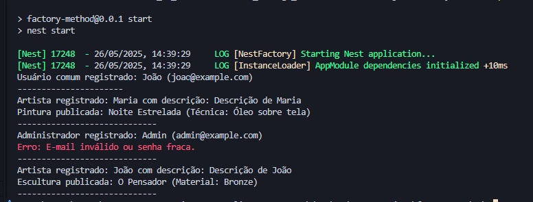

# 3.1.1 Factory Method

## Introdução

O Factory Method é um padrões de projeto da Gang of Four (GoF) que define uma interface para a criação de objetos em uma superclasse, mas permite que as subclasses decidam qual classe específica será instanciada. Esse padrão é amplamente utilizado para promover a flexibilidade na criação de objetos, delegando a responsabilidade de instanciação às subclasses. Ele é particularmente útil em frameworks e sistemas onde o tipo exato de objeto a ser criado não pode ser determinado antecipadamente pela classe base.

O Factory Method é conhecido também como "Construtor Virtual" e é comumente aplicado em cenários onde:
- Uma classe não pode prever a classe exata dos objetos que precisa criar;
- É necessário permitir que subclasses especifiquem os objetos a serem criados;
- A responsabilidade de criação é delegada a subclasses auxiliares, localizando o conhecimento sobre qual classe concreta será instanciada.


## Objetivo

O objetivo principal do padrão Factory Method é proporcionar uma maneira de criar objetos sem especificar diretamente suas classes concretas, permitindo que subclasses decidam qual tipo de objeto será instanciado. Ele promove a separação entre a lógica de criação de objetos e a lógica de negócios, garantindo maior flexibilidade e extensibilidade no sistema. O padrão é projetado para:
- Desacoplar o código cliente das classes concretas, trabalhando apenas com interfaces ou classes abstratas;
- Facilitar a extensão do sistema com novos tipos de produtos sem alterar o código existente;
- Permitir a reutilização de objetos existentes, quando aplicável, para otimizar recursos.

Por exemplo, em um sistema de logística, o Factory Method pode ser usado para criar diferentes tipos de transporte (como caminhões ou navios) sem que o código cliente precise conhecer os detalhes de cada implementação.

## Vantagens

O uso do padrão Factory Method oferece diversos benefícios, incluindo:
- **Desacoplamento**: Reduz o acoplamento entre o código cliente e as classes concretas, permitindo que o cliente trabalhe com interfaces ou classes abstratas, o que facilita a manutenção e a evolução do sistema.
- **Princípio da Responsabilidade Única**: Concentra a lógica de criação de objetos em um único lugar (o método fábrica), tornando o código mais organizado e fácil de manter.
- **Princípio Aberto/Fechado**: Permite a introdução de novos tipos de produtos sem modificar o código existente, apenas criando novas subclasses que implementam o método fábrica.
- **Flexibilidade para Subclasses**: Oferece um "gancho" para que subclasses forneçam implementações específicas, permitindo personalização sem alterar a lógica principal.
- **Suporte a Hierarquias Paralelas**: Facilita a conexão entre hierarquias de classes relacionadas, como em sistemas onde objetos manipuladores (ex.: Manipulator) são criados para corresponder a objetos principais (ex.: Figure).

## Desvantagens

Apesar de suas vantagens, o Factory Method também apresenta algumas limitações:
- **Complexidade Adicional**: A introdução do padrão pode aumentar a complexidade do código, especialmente se muitas subclasses forem criadas apenas para implementar o método fábrica.
- **Necessidade de Subclasses**: Em alguns casos, o cliente pode precisar criar subclasses do criador apenas para instanciar um tipo específico de produto, o que pode ser inconveniente se a subclasse não for necessária para outros fins.
- **Curva de Aprendizado**: Para equipes menos experientes, o padrão pode ser difícil de entender e aplicar corretamente, especialmente em sistemas simples onde a criação direta de objetos seria suficiente.
- **Possível Sobrecarga em Pequenos Projetos**: Em projetos menores ou com requisitos estáticos, o uso do Factory Method pode ser desnecessário, adicionando overhead desproporcional.

## Metodologia

Colocar depois

## Código

Foi implementado dois códigos no padrão Factory Method, um de criação de usuário e outro de envio de arte, segue abaixo:

#### userFactory


```ts
// Interface do Produto (Usuário)
interface User {
    register(): void;
    getRole(): string;
  }
  
  // Produtos Concretos (Usuários)
  class CommonUser implements User {
    constructor(
      private name: string,
      private email: string,
      private password: string
    ) {}
  
    register(): void {
      console.log(`Usuário comum registrado: ${this.name} (${this.email})`);
    }
  
    getRole(): string {
      return "CommonUser";
    }
  }
  
  class Artist implements User {
    constructor(
      private name: string,
      private email: string,
      private password: string,
      private description?: string
    ) {}
  
    register(): void {
      console.log(
        `Artista registrado: ${this.name} com descrição: ${this.description || "N/A"}`
      );
    }
  
    getRole(): string {
      return "Artist";
    }
  }
  
  class Admin implements User {
    constructor(
      private name: string,
      private email: string,
      private password: string
    ) {}
  
    register(): void {
      console.log(`Administrador registrado: ${this.name} (${this.email})`);
    }
  
    getRole(): string {
      return "Admin";
    }
  }
  
  // Interface Creator (Usuário)
  export abstract class UserFactory {
    abstract createUser(
      name: string,
      email: string,
      password: string,
      extraInfo?: string
    ): User;
  
    registerUser(name: string, email: string, password: string, extraInfo?: string): void {
      const user = this.createUser(name, email, password, extraInfo);
      // Validação comum (ex.: verificar se o e-mail é válido)
      if (this.isValidEmail(email) && this.isValidPassword(password)) {
        user.register();
      } else {
        throw new Error("E-mail inválido ou senha fraca.");
      }
    }
  
    private isValidEmail(email: string): boolean {
      // Simulação de validação de e-mail
      const emailRegex = /^[^\s@]+@[^\s@]+\.[^\s@]+$/;
      return emailRegex.test(email);
    }
  
    private isValidPassword(password: string): boolean {
      // Exemplo: senha deve ter pelo menos 6 caracteres
      return password.length >= 6;
    }
  }
  
  // Concrete Creators (Usuário)
  export class CommonUserFactory extends UserFactory {
    createUser(name: string, email: string, password: string): User {
      return new CommonUser(name, email, password);
    }
  }
  
  export class ArtistFactory extends UserFactory {
    createUser(name: string, email: string, password: string, extraInfo?: string): User {
      return new Artist(name, email, password, extraInfo);
    }
  }
  
  export class AdminFactory extends UserFactory {
    createUser(name: string, email: string, password: string): User {
      return new Admin(name, email, password);
    }
  }
```

<font size="2"><p style="text-align: center"><b>Autores:</b> Renan Araújo, Danielle Rodrigues, 2025</p></font>


#### artworkFactory


```ts
// Interface do Produto (Obra de Arte)
interface Artwork {
    publish(): void;
    getType(): string;
  }
  
  // Produtos Concretos (Obras de Arte)
  class Painting implements Artwork {
    constructor(
      private title: string,
      private technique: string,
      private description: string,
      private image: string
    ) {}
  
    publish(): void {
      console.log(`Pintura publicada: ${this.title} (Técnica: ${this.technique})`);
    }
  
    getType(): string {
      return "Painting";
    }
  }
  
  class Sculpture implements Artwork {
    constructor(
      private title: string,
      private material: string,
      private description: string,
      private image: string
    ) {}
  
    publish(): void {
      console.log(`Escultura publicada: ${this.title} (Material: ${this.material})`);
    }
  
    getType(): string {
      return "Sculpture";
    }
  }
  
  // Interface Creator (Obra de Arte)
  export abstract class ArtworkFactory {
    abstract createArtwork(
      title: string,
      techniqueOrMaterial: string,
      description: string,
      image: string
    ): Artwork;
  
    publishArtwork(
      title: string,
      techniqueOrMaterial: string,
      description: string,
      image: string
    ): void {
      const artwork = this.createArtwork(title, techniqueOrMaterial, description, image);
      // Validação comum
      if (this.isValidImage(image) && this.isValidTitle(title)) {
        artwork.publish();
      } else {
        throw new Error("Imagem ou título inválidos.");
      }
    }
  
    private isValidImage(image: string): boolean {
      // Simulação de validação de imagem
      return image.endsWith(".jpg") || image.endsWith(".png");
    }
  
    private isValidTitle(title: string): boolean {
      // Título deve ter pelo menos 3 caracteres
      return title.length >= 3;
    }
  }
  
  // Concrete Creators (Obra de Arte)
  export class PaintingFactory extends ArtworkFactory {
    createArtwork(
      title: string,
      technique: string,
      description: string,
      image: string
    ): Artwork {
      return new Painting(title, technique, description, image);
    }
  }
  
  export class SculptureFactory extends ArtworkFactory {
    createArtwork(
      title: string,
      material: string,
      description: string,
      image: string
    ): Artwork {
      return new Sculpture(title, material, description, image);
    }
  }
```

<font size="2"><p style="text-align: center"><b>Autores:</b> Renan Araújo, Danielle Rodrigues, 2025</p></font>


#### app.modules


```ts
import { Injectable } from '@nestjs/common';
import { UserService } from './user/user.service';
import { ArtworkService } from './artwork/artwork.service';

@Injectable()
export class AppService {
  constructor(
    private readonly userService: UserService,
    private readonly artworkService: ArtworkService,
  ) {}

  private executeOperation(operation: () => void, separator: string = '----------------------'): void {
    try {
      operation();
      console.log(separator);
    } catch (error: unknown) {
      if (error instanceof Error) {
        console.error(`Erro: ${error.message}`);
      } else {
        console.error(`Erro desconhecido: ${error}`);
      }
      console.log(separator);
    }
  }

  async runOperations(): Promise<void> {
    try {
      // 1. Usuário comum (não publica obra)
      this.executeOperation(() => {
        this.userService.registerCommonUser('João', 'joao@example.com', '123456');
      }, '----------------------');

      // 2. Artista Maria publica uma pintura
      this.executeOperation(() => {
        this.userService.registerArtist('Maria', 'maria@example.com', '123456', 'Descrição de Maria');
        this.artworkService.publishPainting(
          'Noite Estrelada',
          'Óleo sobre tela',
          'Pintura clássica',
          'imagem.jpg',
        );
      }, '-----------------------------');

      // 3. Administrador e erro de e-mail inválido
      this.executeOperation(() => {
        this.userService.registerAdmin('Admin', 'admin@example.com', 'admin123');
        this.userService.registerCommonUser('Teste', 'email_invalido', '123456');
      }, '-----------------------------');

      // 4. Artista João publica uma escultura
      this.executeOperation(() => {
        this.userService.registerArtist('João', 'joao2@example.com', '123456', 'Descrição de João');
        this.artworkService.publishSculpture(
          'O Pensador',
          'Bronze',
          'Escultura icônica',
          'escultura.png',
        );
      }, '-----------------------------');
    } catch (error: unknown) {
      if (error instanceof Error) {
        console.error(`Erro inesperado: ${error.message}`);
      } else {
        console.error(`Erro desconhecido inesperado: ${error}`);
      }
    }
  }
}
```

<font size="2"><p style="text-align: center"><b>Autores:</b> Renan Araújo, Danielle Rodrigues, 2025</p></font>


### Resultados do Código

<div style="text-align: center;">



</div>

<font size="2"><p style="text-align: center"><b>Autores:</b> Renan Araújo, Danielle Rodrigues, 2025</p></font>


### Passo a Passo para Rodar o Código

1. Entre na pasta `docs/PadroesDeProjeto/factory-method`:
   ```bash
   cd docs/PadroesDeProjeto/factory-method
   ```
2. Instale as dependências com:
   ```bash
   npm install
   ```
3. Rode o projeto com:
   ```bash
   npm start
   ```


## Referências

> Gamma, E., Helm, R., Johnson, R., & Vlissides, J. (1995). *Design Patterns: Elements of Reusable Object-Oriented Software*. Addison-Wesley.
> Refactoring Guru. (s.d.). *Factory Method*. Disponível em: <https://refactoring.guru/design-patterns/factory-method>.


## Histórico de Versões

| Versão | Data       | Descrição                                             | Autor(es)                                   | Revisor(es)                                   |
| ------ | ---------- | ----------------------------------------------------- | ------------------------------------------- | --------------------------------------------- |
| 1.0    | 23/05/2025 | Criação inicial do documento sobre Factory Method      |  [Renan Araújo](https://github.com/renantfm4), [Danielle Rodrigues](https://github.com/Danizelle)                                 | -                                             |
| 1.1  | 24/05/2025 | Adicionando o código ao projeto e no Mkdocs do Factory Method      |  [Renan Araújo](https://github.com/renantfm4), [Danielle Rodrigues](https://github.com/Danizelle)                                 | -                                             |
| 1.2  | 24/05/2025 | Adicionando NESTJs ao projeto     |  [Renan Araújo](https://github.com/renantfm4), [Danielle Rodrigues](https://github.com/Danizelle)                                 | -                                             |
