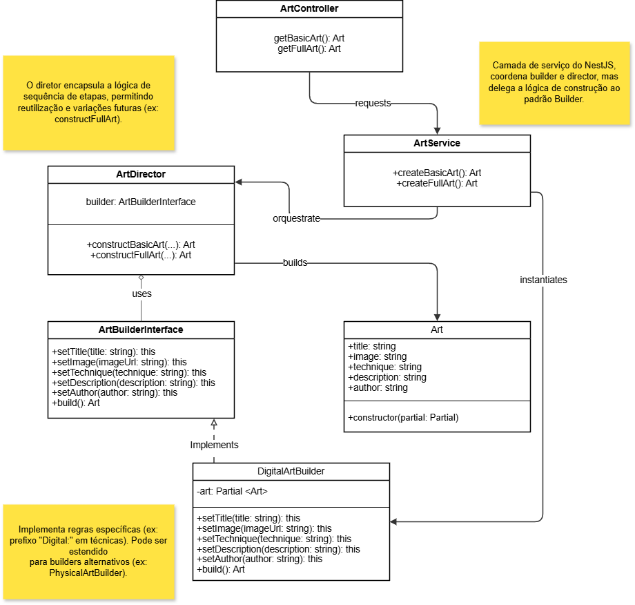

# GoF Criacional – Builder

## Introdução

O padrão **GoF Builder** é um padrão criacional que ajuda a construir objetos complexos passo a passo. Ele é útil quando queremos criar objetos com muitos atributos ou variações, e queremos separar a lógica de construção da representação final.

No projeto **Pinacoteca Online**, o padrão foi aplicado na classe `Art`, que representa uma obra de arte submetida por um artista. Como essa classe tem vários atributos e pode ter diferentes tipos de obras (pinturas digitais, esculturas, etc.), o uso do Builder ajudou a organizar e padronizar a criação dessas obras.

## Metodologia

1. **Análise do Diagrama de Classes**
   - Revisamos as classes principais do projeto.
   - Escolhemos a classe `Art` para aplicar o padrão, por ser complexa e importante no sistema.

2. **Modelagem do Padrão**
   - Criamos:
     - Uma interface chamada `ArtBuilderInterface`
     - Uma classe concreta chamada `DigitalArtBuilder`
     - Uma classe `ArtDirector` para orquestrar a construção
     - A classe `Art` como produto final

3. **Implementação Funcional**
   - Usamos o NestJS, seguindo a estrutura do projeto.
   - Implementamos métodos para criar obras básicas e completas.

---

## Diagrama do GoF Builder

<b>Figura 1:</b> Diagrama Criacional Builder.

<b>Autor:</b> Lucas Heler Lopes, 2025.

---
## Código

---

## Análise dos Resultados

---
## Conclusão

---

## Bibliografia
> Builder - Padrão Criacional. Refactoring Guru. Disponível em: https://refactoring.guru/pt-br/design-patterns/builder. Acesso em: 24 de maio. de 2025.

> GoF Design Patterns - with examples using Java and UML2. Benneth Christiansson (Ed.), Mattias Forss, Ivar Hagen, Kent Hansson, Johan Jonasson, Mattias Jonasson, Fredrik Lott, Sara Olsson e Thomas Rosevall. Disponível em: [https://edeleastar-portfolio.github.io/design-patterns-with-enterprise-arch/topic00-catalogues/talk-4/GoF_DesignPatterns_Java_UML.pdf ](https://edeleastar-portfolio.github.io/design-patterns-with-enterprise-arch/topic00-catalogues/talk-4/GoF_DesignPatterns_Java_UML.pdf ). Acesso em: 24 de maio de 2025.

## Histórico de Versões

| Versão | Data       | Descrição            | Autor(es)                             | Revisor(es)                              | Detalhes da revisão |
| ------ | ---------- | -------------------- | ------------------------------------- | ---------------------------------------- | ------------------- |
| 1.0    | 24/05/2025 | Adição do conteúdo do Gof Criacional Builder(Introdução, Metodologia e Diagrama)  | [Lucas Heler](https://github.com/akaeboshi)    |  |                     |
