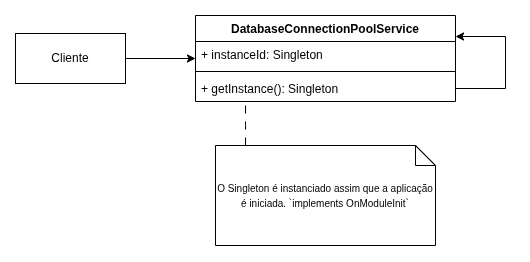

# 3.1.1. Padrão de Projeto GoF - Singleton

## Introdução

Este documento tem como objetivo apresentar a aplicação do padrão de projeto Singleton, um dos padrões GoF (Gang of Four), no contexto do sistema representado pelo diagrama de componentes fornecido. O padrão Singleton é utilizado para garantir que uma classe tenha apenas uma instância e fornecer um ponto de acesso global a ela. É frequentemente aplicado em casos onde componentes únicos da aplicação precisam ser compartilhados por diferentes partes do sistema.

## Metodologia

Com base no escopo do sistema e no diagrama de componentes fornecido, foram analisadas diversas áreas em que a aplicação do padrão Singleton seria pertinente. A avaliação considerou critérios como centralização de controle, necessidade de uma única fonte de verdade e reutilização de instâncias compartilhadas.

Durante o processo de análise, foram considerados os seguintes candidatos ao uso de Singleton:

1. **Gerenciador de Conexão com o Banco de Dados**
2. **Serviço de Configuração Global**
3. **Serviço de Logging**
4. **Gerenciador de Cache**
5. **Sistema de Análise de Reports**

Dentre esses, o **Gerenciador de Conexão com o Banco de Dados** foi selecionado como exemplo prático neste documento por ser um caso clássico de uso de Singleton, permitindo a gestão eficiente e segura de conexões com o banco em aplicações web.

## Desenvolvimento

No projeto **Pinacoteca Online**, o padrão Singleton foi aplicado para gerenciar o pool de conexões com o banco de dados, garantindo que toda a aplicação utilize uma única instância desse serviço. Isso evita desperdício de recursos e garante integridade nas operações de acesso ao banco.

A implementação foi feita utilizando o framework **NestJS**, que já provê, por padrão, o comportamento singleton para seus provedores (services) quando registrados em módulos. O serviço [`DatabaseConnectionPoolService`](/src/database/database-connection-pool.service.ts) simula um pool de conexões e é disponibilizado globalmente pelo [`DatabaseModule`](/src/database/database.module.ts), anotado com `@Global()`.

### Estrutura do Singleton no Projeto

- **Serviço Singleton:**  
  O arquivo [`database-connection-pool.service.ts`](/src/database/database-connection-pool.service.ts) define o serviço do pool de conexões. Ele possui um `instanceId` gerado no construtor para demonstrar que apenas uma instância é criada durante todo o ciclo de vida da aplicação.

- **Módulo Global:**  
  O [`database.module.ts`](/src/database/database.module.ts) registra o serviço como global, tornando-o acessível em qualquer parte da aplicação.

- **Consumidores do Singleton:**  
  Serviços como [`app.service.ts`](/src/app.service.ts) e [`user.service.ts`](/src/user/user.service.ts) recebem o `DatabaseConnectionPoolService` via injeção de dependência. Ambos compartilham a mesma instância, comprovada pelo mesmo `instanceId` nos logs.

#### Código Aplicado

```ts
// /src/database/database-connection-pool.service.ts
import { Injectable, OnModuleInit, Logger } from "@nestjs/common";

@Injectable()
export class DatabaseConnectionPoolService implements OnModuleInit {
  private readonly logger = new Logger(DatabaseConnectionPoolService.name);
  private connections: string[] = [];
  private readonly MAX_CONNECTIONS = 5;
  private instanceId: string;

  constructor() {
    this.instanceId = Math.random().toString(36).substring(2, 15);
    this.logger.log(
      `DatabaseConnectionPoolService instance CREATED (ID: ${this.instanceId})`
    );
    this.initializePool();
  }

  onModuleInit() {
    this.logger.log(
      `DatabaseConnectionPoolService (ID: ${this.instanceId}) has been initialized.`
    );
  }

  private initializePool() {
    for (let i = 0; i < this.MAX_CONNECTIONS; i++) {
      this.connections.push(`mock_connection_${i + 1}_idle`);
    }
    this.logger.log(
      `Connection pool initialized with ${this.connections.length} mock connections by instance ID: ${this.instanceId}`
    );
  }

  getConnection(): string | null {
    const availableConnection = this.connections.find((conn) =>
      conn.endsWith("_idle")
    );

    if (availableConnection) {
      const connIndex = this.connections.indexOf(availableConnection);
      this.connections[connIndex] = availableConnection.replace(
        "_idle",
        "_active"
      );
      this.logger.log(
        `[Instance ID: ${this.instanceId}] Connection '${this.connections[connIndex]}' acquired.`
      );
      this.printPoolStatus();
      return this.connections[connIndex];
    }

    this.logger.warn(
      `[Instance ID: ${this.instanceId}] No idle connections available. Pool is full.`
    );
    this.printPoolStatus();
    return null;
  }

  releaseConnection(connectionName: string): void {
    const connIndex = this.connections.findIndex(
      (conn) => conn === connectionName && conn.endsWith("_active")
    );

    if (connIndex !== -1) {
      this.connections[connIndex] = this.connections[connIndex].replace(
        "_active",
        "_idle"
      );
      this.logger.log(
        `[Instance ID: ${this.instanceId}] Connection '${connectionName}' released.`
      );
      this.printPoolStatus();
    } else {
      this.logger.warn(
        `[Instance ID: ${this.instanceId}] Attempted to release an invalid or already idle connection: ${connectionName}`
      );
    }
  }

  private printPoolStatus(): void {
    const activeCount = this.connections.filter((conn) =>
      conn.endsWith("_active")
    ).length;
    const idleCount = this.connections.filter((conn) =>
      conn.endsWith("_idle")
    ).length;
    this.logger.log(
      `[Instance ID: ${this.instanceId}] Pool Status: Active = ${activeCount}, Idle = ${idleCount}`
    );
  }

  getPoolInstanceId(): string {
    return this.instanceId;
  }
}
```

<font size="2"><p style="text-align: center"><b>Figura 1:</b> Diagrama de classes representando o padrão Singleton (GoF)</p></font>

<div style="text-align: center;">



</div>

<font size="2"><p style="text-align: center"><b>Autor:</b> <a href="https://github.com/fsousac">Felipe de Sousa</a>, 2025</p></font>

## Demonstração do Código sendo Executado

- [Execução do Código](https://drive.google.com/file/d/1unL3uk9lc_retxDSOczFydXtcVDU-4Z-/view?usp=drive_link)</br>
  Participantes: Felipe de Sousa, Marllon</br>

## Conclusão

A aplicação do padrão Singleton no serviço de pool de conexões do projeto **Pinacoteca Online** permitiu centralizar e otimizar o uso de recursos, garantindo que toda a aplicação utilize uma única instância para gerenciar as conexões ao banco de dados. Com o suporte do NestJS, a implementação foi simples e transparente, assegurando eficiência, integridade e facilidade de manutenção ao compartilhar a mesma instância entre diferentes módulos e serviços do sistema.

## Bibliografia

> Refactoring Guru. _Singleton_. Disponível em: https://refactoring.guru/pt-br/design-patterns/singleton. Acesso em: 27 maio 2025.

> SERRANO, Milene. AULA - GOFS CRIACIONAIS. Slides. Universidade de Brasília, 2025. Acesso em: 27 maio 2025.

> GAMMA, Erich; HELM, Richard; JOHNSON, Ralph; VLISSIDES, John. _Design Patterns: Elements of Reusable Object-Oriented Software_. Addison-Wesley, 1994.

> NESTJS. _Official Documentation_. Disponível em: [https://docs.nestjs.com](https://docs.nestjs.com)

> POSTGRESQL. _Node.js and PostgreSQL_. Disponível em: [https://node-postgres.com](https://node-postgres.com)

## Histórico de Versões

| Versão | Data       | Descrição                                                             | Autor(es)                                     | Revisor(es) | Detalhes da revisão |
| ------ | ---------- | --------------------------------------------------------------------- | --------------------------------------------- | ----------- | ------------------- |
| 1.0    | 22/05/2025 | Inicialização do Documento com Introdução, Metodologia e Bibliografia | [Felipe de Sousa](https://github.com/fsousac) | <<Revisor>> | <<Review>>          |
| 1.1    | 22/05/2025 | Mudança de código para conexão de banco de dados                      | [Felipe de Sousa](https://github.com/fsousac) | <<Revisor>> | <<Review>>          |
| 1.2    | 29/05/2025 | Adição do código à documentação                                       | [Marllon](https://github.com/m4rllon)         | <<Revisor>> | <<Review>>          |
| 1.3    | 29/05/2025 | Adição do Diagrama                                                    | [Felipe de Sousa](https://github.com/fsousac) | <<Revisor>> | <<Review>>          |
| 1.4    | 30/05/2025 | Adição do vídeo do código                                             | [Felipe de Sousa](https://github.com/fsousac) | <<Revisor>> | <<Review>>          |
