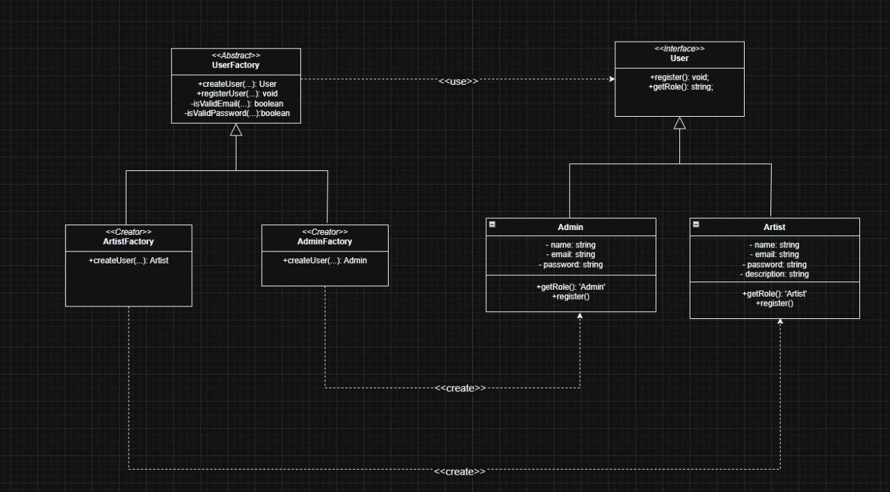
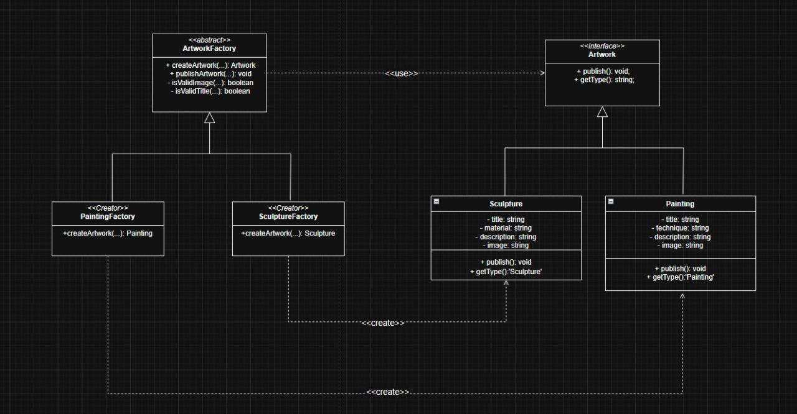

# 3.1.1 Factory Method

## Introdução

O Factory Method (Método de Fábrica) é um padrão criacional de projeto que fornece uma interface para criar objetos em uma superclasse, mas permite que as subclasses alterem o tipo de objetos que serão criados[2]. Esse padrão é amplamente utilizado para promover a flexibilidade na criação de objetos, delegando a responsabilidade de instanciação às subclasses. É particularmente útil em frameworks e sistemas em que o tipo exato de objeto a ser criado não pode ser determinado antecipadamente pela classe base.

O Factory Method também é conhecido como "Construtor Virtual" e é comumente aplicado em cenários nos quais[1]:

- uma classe não pode prever a classe exata dos objetos que precisa criar;
- é necessário permitir que subclasses especifiquem os objetos a serem criados;
- a responsabilidade de criação é delegada a subclasses auxiliares, localizando o conhecimento sobre qual classe concreta será instanciada.


## Objetivo

O objetivo principal do padrão Factory Method é proporcionar uma maneira de criar objetos sem especificar diretamente suas classes concretas, permitindo que subclasses decidam qual tipo de objeto será instanciado. Ele promove a separação entre a lógica de criação de objetos e a lógica de negócios, garantindo maior flexibilidade e extensibilidade no sistema. O padrão é projetado para:
- Desacoplar o código cliente das classes concretas, trabalhando apenas com interfaces ou classes abstratas;
- Facilitar a extensão do sistema com novos tipos de produtos sem alterar o código existente;
- Permitir a reutilização de objetos existentes, quando aplicável, para otimizar recursos.

Por exemplo, em um sistema de logística, o Factory Method pode ser usado para criar diferentes tipos de transporte (como caminhões ou navios) sem que o código cliente precise conhecer os detalhes de cada implementação.

## Vantagens

O uso do padrão Factory Method oferece diversos benefícios, incluindo:
- **Desacoplamento**: Reduz o acoplamento entre o código cliente e as classes concretas, permitindo que o cliente trabalhe com interfaces ou classes abstratas, o que facilita a manutenção e a evolução do sistema.
- **Princípio da Responsabilidade Única**: Concentra a lógica de criação de objetos em um único lugar (o método fábrica), tornando o código mais organizado e fácil de manter.
- **Princípio Aberto/Fechado**: Permite a introdução de novos tipos de produtos sem modificar o código existente, apenas criando novas subclasses que implementam o método fábrica.
- **Flexibilidade para Subclasses**: Oferece um "gancho" para que subclasses forneçam implementações específicas, permitindo personalização sem alterar a lógica principal.
- **Suporte a Hierarquias Paralelas**: Facilita a conexão entre hierarquias de classes relacionadas, como em sistemas onde objetos manipuladores (ex.: Manipulator) são criados para corresponder a objetos principais (ex.: Figure).

## Desvantagens

Apesar de suas vantagens, o Factory Method também apresenta algumas limitações:
- **Complexidade Adicional**: A introdução do padrão pode aumentar a complexidade do código, especialmente se muitas subclasses forem criadas apenas para implementar o método fábrica.
- **Necessidade de Subclasses**: Em alguns casos, o cliente pode precisar criar subclasses do criador apenas para instanciar um tipo específico de produto, o que pode ser inconveniente se a subclasse não for necessária para outros fins.
- **Curva de Aprendizado**: Para equipes menos experientes, o padrão pode ser difícil de entender e aplicar corretamente, especialmente em sistemas simples onde a criação direta de objetos seria suficiente.
- **Possível Sobrecarga em Pequenos Projetos**: Em projetos menores ou com requisitos estáticos, o uso do Factory Method pode ser desnecessário, adicionando overhead desproporcional.

## Metodologia

Para a realização deste projeto, adotamos uma abordagem estruturada, utilizando um conjunto de ferramentas e tecnologias para o desenvolvimento, documentação e validação do padrão Factory Method. Abaixo estão listadas as ferramentas empregadas e suas respectivas finalidades:

- **Draw.io**: Utilizado para a criação dos diagramas que ilustram a estrutura do padrão Factory Method, facilitando a visualização das relações entre classes e interfaces.
- **Visual Studio Code (VSCode)**: Empregado como ambiente de desenvolvimento integrado (IDE) para a escrita, edição e depuração do código-fonte.
- **YouTube**: Utilizado para gravar e compartilhar vídeos demonstrando o funcionamento do código implementado, permitindo a validação visual dos resultados.
- **Docsify**: Ferramenta usada para o desenvolvimento e geração da documentação do projeto, garantindo uma apresentação clara e acessível do conteúdo.
- **NestJS**: Framework principal utilizado para o desenvolvimento do backend, estruturando o projeto com uma arquitetura modular e escalável.
- **TypeScript**: Linguagem de programação adotada para garantir tipagem estática, aumentando a robustez e a manutenibilidade do código.

O desenvolvimento seguiu uma abordagem iterativa, iniciando com o estudo aprofundado do padrão Factory Method por meio das referências bibliográficas: Design Patterns: Elements of Reusable Object-Oriented Software (Gamma et al., 1995) e o artigo Factory Method do Refactoring Guru. Essas fontes foram fundamentais para compreender os conceitos teóricos do padrão, suas aplicações práticas e melhores práticas de implementação, orientando a elaboração dos diagramas no Draw.io, realizada por Danielle, e a implementação do código no VSCode com NestJS e TypeScript, conduzida por Renan, além da redação do documento no Docsify. A documentação foi desenvolvida em conjunto e em parelelo, consolidando os aprendizados teóricos e práticos. Os resultados foram validados por meio de testes e gravações no YouTube, garantindo a correta aplicação do padrão Factory Method.

Essa metodologia, apoiada nas referências estudadas, assegurou a organização do projeto, a clareza na comunicação das ideias e a validação prática do padrão implementado.

## Diagramas

<font size="2"><p style="text-align: center"><b>Figura 1:</b> Criação de Usuários</div>

<div style="text-align: center;">



</div>

<font size="2"><p style="text-align: center"><b>Autores:</b> Renan Araújo, Danielle Rodrigues, 2025</p></font>


<font size="2"><p style="text-align: center"><b>Figura 2:</b> Submissão de Arte</div>

<div style="text-align: center;">



</div>

<font size="2"><p style="text-align: center"><b>Autores:</b> Renan Araújo, Danielle Rodrigues, 2025</p></font>

## Código

Foi implementado dois códigos no padrão Factory Method, um de criação de usuário e outro de envio de arte, segue abaixo:

#### [userFactory](https://github.com/UnBArqDsw2025-1-Turma01/2025.1-T01-_G2_PinacotecaOnline_Entrega_03/blob/code-factorymethod/factory-method/src/user/userFactory.ts)


```ts
interface User {
  register(): void;
  getRole(): string;
}

class Artist implements User {
  constructor(
    private name: string,
    private email: string,
    private password: string,
    private description?: string
  ) {}

  register(): void {
    console.log(
      `Artista registrado: ${this.name} com descrição: ${this.description || "N/A"}`
    );
  }

  getRole(): string {
    return "Artist";
  }
}

class Admin implements User {
  constructor(
    private name: string,
    private email: string,
    private password: string
  ) {}

  register(): void {
    console.log(`Administrador registrado: ${this.name} (${this.email})`);
  }

  getRole(): string {
    return "Admin";
  }
}

export abstract class UserFactory {
  abstract createUser(
    name: string,
    email: string,
    password: string,
    extraInfo?: string
  ): User;

  registerUser(name: string, email: string, password: string, extraInfo?: string): void {
    const user = this.createUser(name, email, password, extraInfo);
    if (this.isValidEmail(email) && this.isValidPassword(password)) {
      user.register();
    } else {
      throw new Error("E-mail inválido ou senha fraca.");
    }
  }

  private isValidEmail(email: string): boolean {
    const emailRegex = /^[^\s@]+@[^\s@]+\.[^\s@]+$/;
    return emailRegex.test(email);
  }

  private isValidPassword(password: string): boolean {
    return password.length >= 6;
  }
}

export class ArtistFactory extends UserFactory {
  createUser(name: string, email: string, password: string, extraInfo?: string): User {
    return new Artist(name, email, password, extraInfo);
  }
}

export class AdminFactory extends UserFactory {
  createUser(name: string, email: string, password: string): User {
    return new Admin(name, email, password);
  }
}
```

<font size="2"><p style="text-align: center"><b>Autores:</b> Renan Araújo, Danielle Rodrigues, 2025</p></font>

#### [user.service](https://github.com/UnBArqDsw2025-1-Turma01/2025.1-T01-_G2_PinacotecaOnline_Entrega_03/blob/code-factorymethod/factory-method/src/user/user.service.ts)


```ts
import { Injectable } from '@nestjs/common';
import { ArtistFactory, AdminFactory } from './userFactory';

@Injectable()
export class UserService {
  private artistFactory = new ArtistFactory();
  private adminFactory = new AdminFactory();

  registerArtist(name: string, email: string, password: string, description?: string): void {
    this.artistFactory.registerUser(name, email, password, description);
  }

  registerAdmin(name: string, email: string, password: string): void {
    this.adminFactory.registerUser(name, email, password);
  }
}
```

<font size="2"><p style="text-align: center"><b>Autores:</b> Renan Araújo, Danielle Rodrigues, 2025</p></font>


#### [artworkFactory](https://github.com/UnBArqDsw2025-1-Turma01/2025.1-T01-_G2_PinacotecaOnline_Entrega_03/blob/code-factorymethod/factory-method/src/artwork/artworkFactory.ts)


```ts
// Interface do Produto (Obra de Arte)
interface Artwork {
    publish(): void;
    getType(): string;
  }
  
  // Produtos Concretos (Obras de Arte)
  class Painting implements Artwork {
    constructor(
      private title: string,
      private technique: string,
      private description: string,
      private image: string
    ) {}
  
    publish(): void {
      console.log(`Pintura publicada: ${this.title} (Técnica: ${this.technique})`);
    }
  
    getType(): string {
      return "Painting";
    }
  }
  
  class Sculpture implements Artwork {
    constructor(
      private title: string,
      private material: string,
      private description: string,
      private image: string
    ) {}
  
    publish(): void {
      console.log(`Escultura publicada: ${this.title} (Material: ${this.material})`);
    }
  
    getType(): string {
      return "Sculpture";
    }
  }
  
  // Interface Creator (Obra de Arte)
  export abstract class ArtworkFactory {
    abstract createArtwork(
      title: string,
      techniqueOrMaterial: string,
      description: string,
      image: string
    ): Artwork;
  
    publishArtwork(
      title: string,
      techniqueOrMaterial: string,
      description: string,
      image: string
    ): void {
      const artwork = this.createArtwork(title, techniqueOrMaterial, description, image);
      // Validação comum
      if (this.isValidImage(image) && this.isValidTitle(title)) {
        artwork.publish();
      } else {
        throw new Error("Imagem ou título inválidos.");
      }
    }
  
    private isValidImage(image: string): boolean {
      // Simulação de validação de imagem
      return image.endsWith(".jpg") || image.endsWith(".png");
    }
  
    private isValidTitle(title: string): boolean {
      // Título deve ter pelo menos 3 caracteres
      return title.length >= 3;
    }
  }
  
  // Concrete Creators (Obra de Arte)
  export class PaintingFactory extends ArtworkFactory {
    createArtwork(
      title: string,
      technique: string,
      description: string,
      image: string
    ): Artwork {
      return new Painting(title, technique, description, image);
    }
  }
  
  export class SculptureFactory extends ArtworkFactory {
    createArtwork(
      title: string,
      material: string,
      description: string,
      image: string
    ): Artwork {
      return new Sculpture(title, material, description, image);
    }
  }
```

<font size="2"><p style="text-align: center"><b>Autores:</b> Renan Araújo, Danielle Rodrigues, 2025</p></font>


#### [artwork.service](https://github.com/UnBArqDsw2025-1-Turma01/2025.1-T01-_G2_PinacotecaOnline_Entrega_03/blob/code-factorymethod/factory-method/src/artwork/artwork.service.ts)


```ts
import { Injectable } from '@nestjs/common';
import { PaintingFactory, SculptureFactory } from './artworkFactory';

@Injectable()
export class ArtworkService {
  private paintingFactory = new PaintingFactory();
  private sculptureFactory = new SculptureFactory();

  publishPainting(title: string, technique: string, description: string, image: string): void {
    this.paintingFactory.publishArtwork(title, technique, description, image);
  }

  publishSculpture(title: string, material: string, description: string, image: string): void {
    this.sculptureFactory.publishArtwork(title, material, description, image);
  }
}
```

<font size="2"><p style="text-align: center"><b>Autores:</b> Renan Araújo, Danielle Rodrigues, 2025</p></font>


#### [app.modules](https://github.com/UnBArqDsw2025-1-Turma01/2025.1-T01-_G2_PinacotecaOnline_Entrega_03/blob/code-factorymethod/factory-method/src/app.module.ts)


```ts
import { Injectable } from '@nestjs/common';
import { UserService } from './user/user.service';
import { ArtworkService } from './artwork/artwork.service';

@Injectable()
export class AppService {
  constructor(
    private readonly userService: UserService,
    private readonly artworkService: ArtworkService,
  ) {}

  private executeOperation(operation: () => void, separator: string = '----------------------'): void {
    try {
      operation();
      console.log(separator);
    } catch (error: unknown) {
      if (error instanceof Error) {
        console.error(`Erro: ${error.message}`);
      } else {
        console.error(`Erro desconhecido: ${error}`);
      }
      console.log(separator);
    }
  }

  async runOperations(): Promise<void> {
    try {
      // 1. Artista Maria publica uma pintura
      this.executeOperation(() => {
        this.userService.registerArtist('Maria', 'maria@example.com', '123456', 'Descrição de Maria');
        this.artworkService.publishPainting(
          'Noite Estrelada',
          'Óleo sobre tela',
          'Pintura clássica',
          'imagem.jpg',
        );
      }, '-----------------------------');

      // 2. Administrador
      this.executeOperation(() => {
        this.userService.registerAdmin('Admin', 'admin@example.com', 'admin123');
        this.userService.registerAdmin('Teste', 'email_invalido', '123456');
      }, '-----------------------------');

      // 3. Artista João publica uma escultura
      this.executeOperation(() => {
        this.userService.registerArtist('João', 'joao2@example.com', '123456', 'Descrição de João');
        this.artworkService.publishSculpture(
          'O Pensador',
          'Bronze',
          'Escultura icônica',
          'escultura.png',
        );
      }, '-----------------------------');
    } catch (error: unknown) {
      if (error instanceof Error) {
        console.error(`Erro inesperado: ${error.message}`);
      } else {
        console.error(`Erro desconhecido inesperado: ${error}`);
      }
    }
  }
}
```

<font size="2"><p style="text-align: center"><b>Autores:</b> Renan Araújo, Danielle Rodrigues, 2025</p></font>


### Resultados do Código

<div style="text-align: center;">


</div>

<font size="2"><p style="text-align: center"><b>Autores:</b> Renan Araújo, Danielle Rodrigues, 2025</p></font>


### Passo a Passo para Rodar o Código

1. Entre na branch `code-factorymethod`:
   ```bash
   git checkout code-factorymethod
   ```
2. Entre na pasta `factory-method`:
   ```bash
   cd factory-method
   ```
3. Instale as dependências com:
   ```bash
   npm install
   ```
4. Rode o projeto com:
   ```bash
   npm start
   ```


## Referências

> [1] Gamma, E., Helm, R., Johnson, R., & Vlissides, J. (1995). *Design Patterns: Elements of Reusable Object-Oriented Software*. Addison-Wesley.
> [2] Refactoring Guru. (s.d.). *Factory Method*. Disponível em: <https://refactoring.guru/design-patterns/factory-method>.


## Histórico de Versões

| Versão | Data       | Descrição                                             | Autor(es)                                   | Revisor(es)                                   |
| ------ | ---------- | ----------------------------------------------------- | ------------------------------------------- | --------------------------------------------- |
| 1.0    | 23/05/2025 | Criação inicial do documento sobre Factory Method      |  [Renan Araújo](https://github.com/renantfm4), [Danielle Rodrigues](https://github.com/Danizelle)                                 | -                                             |
| 1.1  | 24/05/2025 | Adicionando o código ao projeto e no Mkdocs do Factory Method      |  [Renan Araújo](https://github.com/renantfm4), [Danielle Rodrigues](https://github.com/Danizelle)                                 | -                                             |
| 1.2  | 24/05/2025 | Adicionando NESTJs ao projeto     |  [Renan Araújo](https://github.com/renantfm4), [Danielle Rodrigues](https://github.com/Danizelle)                                 | -                                             |
| 1.3  | 29/05/2025 | Adicionando metodologia e diagramas     |  [Renan Araújo](https://github.com/renantfm4), [Danielle Rodrigues](https://github.com/Danizelle)                                 | -                                             |
| 1.4 | 31/05/2025 | Linkando os códigos para nova branch e mudando o passo a passo da instalação     |  [Renan Araújo](https://github.com/renantfm4), [Danielle Rodrigues](https://github.com/Danizelle)                                 | -                                             |
