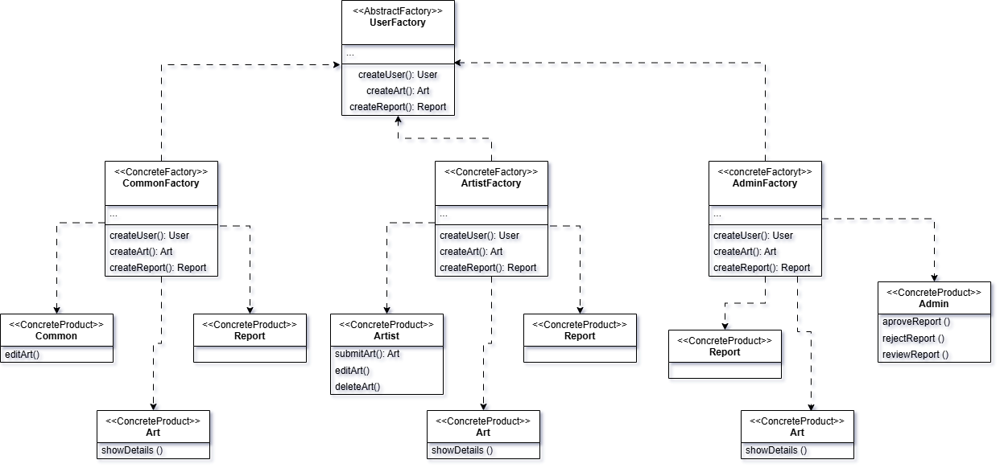

# 3.1.3 Abstract Factory

## Introdução

O **Abstract Factory** é um padrão de projeto da Gang of Four (GoF) pertencente ao grupo dos padrões **Criacionais**, cujo propósito é fornecer uma interface para criar **famílias de objetos relacionados ou dependentes sem especificar suas classes concretas**.

Esse padrão é amplamente utilizado quando há a necessidade de garantir que objetos criados sejam compatíveis entre si, mantendo a consistência dentro de um determinado contexto ou configuração. Ele permite que o código cliente trabalhe com fábricas abstratas, deixando para as implementações concretas a responsabilidade de determinar quais objetos específicos serão instanciados.

## Metodologia

#### Para o desenvolvimento do Abstract Factory, foram adotadas as seguintes etapas metodológicas:

1. Inicialmente, foi ultilizado o diagrama de classes, que serviu como base estrutural para identificar as entidades, seus relacionamentos e as possíveis abstrações necessárias para a aplicação do padrão.

2. Foram utilizados como suporte os slides e as videoaulas disponibilizados pela professora, que forneceram diretrizes teóricas e práticas sobre o funcionamento e a aplicação do padrão Abstract Factory.

3. Também foi consultado o [Guia](https://refactoring.guru/design-patterns/abstract-factory) de orientação fornecido pela professora, que complementou o entendimento sobre os conceitos, as boas práticas de modelagem e os critérios específicos exigidos para a elaboração do diagrama.

4. A modelagem do diagrama foi realizada na ferramenta draw.io, que possibilitou a criação de um diagrama visualmente organizado, de fácil compreensão e aderente aos padrões de modelagem UML.

## Desenvolvimento

A abstract factory foi aplicada para gerenciar a criação de diferentes tipos de usuários no sistema. A interface UserFactory define métodos genéricos para criação de usuários (User) e relatórios (Report), enquanto as fábricas concretas especializam esse comportamento: CommonFactory cria apenas usuários comuns e relatórios, enquanto ArtistFactory e AdminFactory estendem essa funcionalidade, permitindo também a criação de artes (Art). Dessa forma, o design garante que apenas perfis autorizados tenham acesso à criação de obras, promovendo uma arquitetura flexível e segura.

<font size="2"><p style="text-align: center">Figura 1 - Diagrama Abstract Factory.</p></font>

<center>



</center>

<font size="2"><p style="text-align: center">Autor(es): [Jésus Gabriel](https://github.com/xGabrielCv) & [Alana Gabriele](https://github.com/alanagabriele), 2025.</p></font>

## Código

O código completo pode ser visualizado na branch [code-abstract-factory](https://github.com/UnBArqDsw2025-1-Turma01/2025.1-T01-_G2_PinacotecaOnline_Entrega_03/tree/code-abstract-factory).

### Vídeo do código

<iframe width="560" height="315" src="https://www.youtube.com/embed/pxu8skcJJ9E?si=ntwmGCX2qn3mJSQu" title="YouTube video player" frameborder="0" allow="accelerometer; autoplay; clipboard-write; encrypted-media; gyroscope; picture-in-picture; web-share" referrerpolicy="strict-origin-when-cross-origin" allowfullscreen></iframe>

### Fábricas

#### user.factory.service.ts

```typescript
import { Art } from "../shared/models/Art";
import { Report } from "../shared/models/Report";
import { User } from "../shared/models/User";

export abstract class UserFactory {
  abstract createUser(): User;
  abstract createReport(): Report;
}
```

#### admin.factory.service.ts

```typescript
import { Injectable } from "@nestjs/common";
import { ReportStatus } from "src/shared/enums/report-status.enum";
import { ReportType } from "src/shared/enums/report-type.enum";
import { Admin } from "../shared/models/admin";
import { Art } from "../shared/models/Art";
import { Report } from "../shared/models/report";
import { UserFactory } from "./user.factory.interface";

@Injectable()
export class AdminFactory implements UserFactory {
  createUser(): Admin {
    return new Admin(
      99,
      "Alice Admin",
      "alice.admin@example.com",
      "adminStrongPassword",
      "Moderadora do sistema",
      {},
      new Date()
    );
  }

  createArt(): Art {
    return new Art(
      900,
      "Imagem de Moderação",
      "Admin Bot",
      "Arte gerada para revisão manual",
      "https://example.com/moderation.jpg",
      99,
      "Digital"
    );
  }

  createReport(): Report {
    return new Report(
      1,
      ReportType.ART,
      "Comportamento abusivo",
      ReportStatus.PENDING,
      this.createUser(),
      new Date()
    );
  }
}
```

#### artist.factory.service.ts

```typescript
import { Injectable } from "@nestjs/common";
import { ReportStatus } from "src/shared/enums/report-status.enum";
import { ReportType } from "src/shared/enums/report-type.enum";
import { Art } from "../shared/models/Art";
import { Artist } from "../shared/models/artist";
import { Report } from "../shared/models/report";
import { UserFactory } from "./user.factory.interface";

@Injectable()
export class ArtistFactory implements UserFactory {
  createUser(): Artist {
    return new Artist(
      1,
      "Vinícius",
      "vinicius@example.com",
      "senhaSegura123",
      "Pintor impressionista",
      {}, // endereço fictício
      "Biografia do artista",
      new Date(),
      new Date()
    );
  }

  createArt(): Art {
    return new Art(
      101,
      "Nascer do Sol",
      "Vinícius",
      "Uma bela pintura sobre esperança",
      "https://example.com/art.jpg",
      1,
      "Óleo sobre tela"
    );
  }

  createReport(): Report {
    return new Report(
      2,
      ReportType.ART,
      "Uso indevido de imagem",
      ReportStatus.PENDING,
      this.createUser(),
      new Date(),
      new Date()
    );
  }
}
```

#### commom.factory.service.ts

```typescript
import { Injectable } from "@nestjs/common";
import { ReportStatus } from "src/shared/enums/report-status.enum";
import { ReportType } from "src/shared/enums/report-type.enum";
import { CommonUser } from "src/shared/models/common";
import { Art } from "../shared/models/Art";
import { Report } from "../shared/models/report";
import { UserFactory } from "./user.factory.interface";

@Injectable()
export class CommonUserFactory implements UserFactory {
  createUser(): CommonUser {
    return new CommonUser(
      3,
      "Joana Usuária",
      "joana@example.com",
      "senhaSimples123",
      "Usuária comum do sistema",
      {}, // endereço fictício
      new Date()
    );
  }

  createReport(): Report {
    return new Report(
      3,
      ReportType.ART,
      "Conteúdo impróprio",
      ReportStatus.PENDING,
      this.createUser(),
      new Date(),
      new Date()
    );
  }
}
```

## Conclusão

A aplicação do padrão **Abstract Factory** no projeto da **Pinacoteca Online** foi eficaz para organizar a criação dos diferentes tipos de usuários (comum, artista e administrador) e seus respectivos objetos, como arte e relatório. O padrão trouxe uma estrutura clara e facilitou a separação de responsabilidades no sistema. Apesar de adicionar um pouco mais de complexidade, ele se mostrou adequado para atender as necessidades do projeto.

## Gravação da Reunião

- [Vídeo - Criação do Abstract Factory.](https://unbbr.sharepoint.com/sites/G2-PinactoecaOnline-ArqDes/Documentos%20Compartilhados/General/Recordings/Abstract%20Factory-20250523_230505-Grava%C3%A7%C3%A3o%20de%20Reuni%C3%A3o.mp4?web=1&referrer=Teams.TEAMS-WEB&referrerScenario=MeetingChicletGetLink.view.view)</br>
  Participantes: Jésus Gabriel e Alana Gabriele

## Bibliografia

> 1. <a id="ref1"></a> Abstract Factory - Padrão Criacional. Refactoring Guru. Disponível em: [https://refactoring.guru/pt-br/design-patterns/abstract-factory](https://refactoring.guru/pt-br/design-patterns/abstract-factory). Acesso em: 26 de Maio. de 2025.

> 2. <a id="ref1"></a>Gamma, Erich. Padrões de projetos: soluções reutilizáveis. Bookman editora, 2009.

> 3. <a id="ref3"></a> Gamma, E.; Helm, R.; Johnson, R.; Vlissides, J. _Padrões de Projeto: Soluções Reutilizáveis de Software Orientado a Objetos_. Tradução de Luiz A. Meirelles Salgado. Porto Alegre: Bookman, 2007.

> 4. <a id="ref6"></a> Abstract Factory Design Pattern - SourceMaking. Disponível em: [https://sourcemaking.com/design_patterns/abstract_factory](https://sourcemaking.com/design_patterns/abstract_factory). Acesso em: 26 de Maio. de 2025.

> 5. SERRANO, Milene. 08b - Video-Aula - DSW - GoFs - Criacionais - Abstract Factory. [S. l.]. 1 vídeo (aula de Arquitetura e Desenho de Software). Disponível em: https://unbbr-my.sharepoint.com/:v:/g/personal/mileneserrano_unb_br/EX30PA2af_BNlTEvq2onq8EBQEWGRzGlkDKyFSZIF0LitA?e=Hfdty6 Acesso em: 24 maio 2025.

> 6. SERRANO, Milene. Arquitetura e Desenho de Software - Aula - GoFs Criacionais. Disponível em: https://unbbr-my.sharepoint.com/:v:/g/personal/mileneserrano_unb_br/EU5BKTPMklpEumc9FmhiUl8BEbUb-xvaeNXahR4AhazeKQ?e=zHvb48 Acesso em: 24 maio 2025.

## Histórico de Versões

| Versão | Data       | Descrição                                                                                     | Autor(es)                                                                                         | Revisor(es) | Detalhes da revisão |
| ------ | ---------- | --------------------------------------------------------------------------------------------- | ------------------------------------------------------------------------------------------------- | ----------- | ------------------- |
| 1.0    | 24/05/2025 | Criação do documento, modelagem inicial do diagrama e adição da introdução e metodologia.     | [Jésus Gabriel](https://github.com/xGabrielCv) [Alana Gabriele](https://github.com/alanagabriele) |             |                     |
| 1.1    | 26/05/2025 | Adição do diagrama Abstract Factory, desenvolvimento da conclusão e inclusão da bibliografia. | [Jésus Gabriel](https://github.com/xGabrielCv) [Alana Gabriele](https://github.com/alanagabriele) |             |                     |
| 1.2    | 27/05/2025 | Adição da bibliografia completa, gravação da Reunião.                                         | [Jésus Gabriel](https://github.com/xGabrielCv) [Alana Gabriele](https://github.com/alanagabriele) |             |                     |
| 1.3    | 31/05/2025 | Links das Aulas da Professora completos                                                       | [Jésus Gabriel](https://github.com/xGabrielCv) [Alana Gabriele](https://github.com/alanagabriele) |             |                     |
| 1.4    | 01/06/2025 | Adição do código e do vídeo                                                                   | [Jésus Gabriel](https://github.com/xGabrielCv) [Alana Gabriele](https://github.com/alanagabriele) |             |                     |
