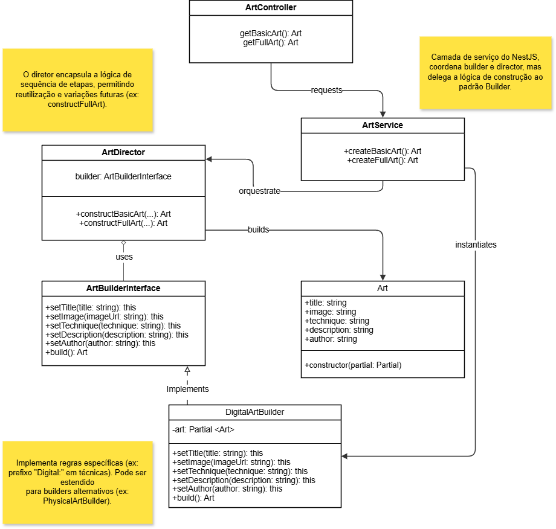

# GoF Criacional – Builder

## Introdução

O padrão **GoF Builder** é um padrão criacional que ajuda a construir objetos complexos passo a passo. Ele é útil quando queremos criar objetos com muitos atributos ou variações, e queremos separar a lógica de construção da representação final.

No projeto **Pinacoteca Online**, o padrão foi aplicado na classe `Art`, que representa uma obra de arte submetida por um artista. Como essa classe tem vários atributos e pode ter diferentes tipos de obras (pinturas digitais, esculturas, etc.), o uso do Builder ajudou a organizar e padronizar a criação dessas obras.

## Metodologia

1. **Análise do Diagrama de Classes**
   - Revisamos as classes principais do projeto.
   - Escolhemos a classe `Art` para aplicar o padrão, por ser complexa e importante no sistema.

2. **Modelagem do Padrão**
   - Criamos:
     - Uma interface chamada `ArtBuilderInterface`
     - Uma classe concreta chamada `DigitalArtBuilder`
     - Uma classe `ArtDirector` para orquestrar a construção
     - A classe `Art` como produto final

3. **Implementação Funcional**
   - Usamos o NestJS, seguindo a estrutura do projeto.
   - Implementamos métodos para criar obras básicas e completas.


---

## Diagrama do GoF Builder

<font size="2"><p style="text-align: center"><b>Figura 1:</b> Diagrama Criacional Builder.</p></font>



<font size="2"><p style="text-align: center"><b>Autor:</b> Lucas Heler Lopes, 2025.</p></font>

---
## Código

Abaixo está todo o código implementado, organizado em caixas de código para facilitar a leitura.

### `art.interface.ts`

```typescript
export interface ArtBuilderInterface {
  setTitle(title: string): this;
  setImage(imageUrl: string): this;
  setTechnique(technique: string): this;
  setDescription(description: string): this;
  setAuthor(author: string): this;
  build(): Art;
}
```

### `art.entity.ts`

```typescript
export class Art {
  title: string;
  image: string;
  technique: string;
  description: string;
  author: string;

  constructor(partial: Partial<Art>) {
    Object.assign(this, partial);
  }
}
```

### `digital-art-builder.ts`

```typescript
import { Art } from '../entities/art.entity';
import { ArtBuilderInterface } from './art.interface';

export class DigitalArtBuilder implements ArtBuilderInterface {
  private art: Partial<Art> = {};

  setTitle(title: string): this {
    this.art.title = title;
    return this;
  }

  setImage(imageUrl: string): this {
    this.art.image = imageUrl;
    return this;
  }

  setTechnique(technique: string): this {
    this.art.technique = `Digital: ${technique}`;
    return this;
  }

  setDescription(description: string): this {
    this.art.description = description;
    return this;
  }

  setAuthor(author: string): this {
    this.art.author = author;
    return this;
  }

  build(): Art {
    return new Art(this.art);
  }
}
```

### `art-director.ts`

```typescript
import { ArtBuilderInterface } from './art.interface';
import { Art } from '../entities/art.entity';

export class ArtDirector {
  constructor(private builder: ArtBuilderInterface) {}

  constructBasicArt(
    title: string,
    imageUrl: string,
    technique: string,
    description: string,
    author: string
  ): Art {
    return this.builder
      .setTitle(title)
      .setImage(imageUrl)
      .setTechnique(technique)
      .setDescription(description)
      .setAuthor(author)
      .build();
  }

  constructFullArt(
    title: string,
    imageUrl: string,
    technique: string,
    description: string,
    author: string
  ): Art {
    return this.builder
      .setTitle(title)
      .setImage(imageUrl)
      .setTechnique(technique)
      .setDescription(description)
      .setAuthor(author)
      .build();
  }
}
```

### `art.service.ts`

```typescript
import { Injectable } from '@nestjs/common';
import { Art } from '../entities/art.entity';
import { DigitalArtBuilder } from './digital-art-builder';
import { ArtDirector } from './art-director';

@Injectable()
export class ArtService {
  createBasicArt(): Art {
    const builder = new DigitalArtBuilder();
    const director = new ArtDirector(builder);

    return director.constructBasicArt(
      'Obra Digital',
      'https://pinacoteca.com/imagens/exemplo.jpg',
      'Pintura Vetorial',
      'Uma obra criada com o padrão Builder.',
      'Van Gogh Digital'
    );
  }

  createFullArt(): Art {
    const builder = new DigitalArtBuilder();
    const director = new ArtDirector(builder);

    return director.constructFullArt(
      'Obra Completa',
      'https://pinacoteca.com/imagens/exemplo2.jpg',
      'Escultura Digital',
      'Uma obra completa com todos os campos preenchidos.',
      'Claude Monet Virtual'
    );
  }
}
```

### `art.controller.ts`

```typescript
import { Controller, Get } from '@nestjs/common';
import { ArtService } from './art.service';
import { Art } from '../entities/art.entity';

@Controller('arts')
export class ArtController {
  constructor(private readonly artService: ArtService) {}

  @Get('basic')
  getBasicArt(): Art {
    return this.artService.createBasicArt();
  }

  @Get('full')
  getFullArt(): Art {
    return this.artService.createFullArt();
  }
}
```

#### Informações adicionais
- [Execução do Código](https://drive.google.com/file/d/1j82jaA_waT2yj3Uh7kKwkiD-j-koBkbn/view?usp=drive_link)<br>
  Participantes: Davi Rodrigues e Lucas Heler
- [Repositório do Código](https://github.com/UnBArqDsw2025-1-Turma01/2025.1-T01-_G2_PinacotecaOnline_Entrega_03/tree/code-builder)

---

## Análise dos Resultados

Com a implementação do padrão **Builder**, ficou mais fácil criar objetos do tipo `Art` de forma flexível e padronizada. O código ficou mais limpo e organizado, e agora podemos construir obras de arte com diferentes variações sem complicar a lógica de criação.

O uso do **Director** também ajudou a centralizar a sequência de construção, permitindo reutilizar etapas e evitar repetição de código.

---
## Conclusão

O padrão **Builder** se mostrou muito útil no projeto **Pinacoteca Online**, especialmente para a criação de obras de arte. Com ele, conseguimos simplificar a construção de objetos complexos, deixando o código mais organizado e fácil de manter.

---

## Bibliografia
> Builder - Padrão Criacional. Refactoring Guru. Disponível em: https://refactoring.guru/pt-br/design-patterns/builder. Acesso em: 24 de maio. de 2025.

> GoF Design Patterns - with examples using Java and UML2. Benneth Christiansson (Ed.), Mattias Forss, Ivar Hagen, Kent Hansson, Johan Jonasson, Mattias Jonasson, Fredrik Lott, Sara Olsson e Thomas Rosevall. Disponível em: [https://edeleastar-portfolio.github.io/design-patterns-with-enterprise-arch/topic00-catalogues/talk-4/GoF_DesignPatterns_Java_UML.pdf ](https://edeleastar-portfolio.github.io/design-patterns-with-enterprise-arch/topic00-catalogues/talk-4/GoF_DesignPatterns_Java_UML.pdf ). Acesso em: 24 de maio de 2025.


## Histórico de Versões

| Versão | Data       | Descrição            | Autor(es)                             | Revisor(es)                              | Detalhes da revisão |
| ------ | ---------- | -------------------- | ------------------------------------- | ---------------------------------------- | ------------------- |
| 1.0    | 24/05/2025 | Adição do conteúdo do Gof Criacional Builder(Introdução, Metodologia e Diagrama)  | [Lucas Heler](https://github.com/akaeboshi)    | [Danielle Rodrigues](https://github.com/Danizelle) |   Revisão da Introdução, Metodologia e Diagrama. Tudo de acordo!                 |
| 1.1    | 24/05/2025 | Adição do código construído a partir dos diagramas realizados (Código, Análise e Conclusão)  | [Davi Rodrigues](https://github.com/DaviRogs)    | [Danielle Rodrigues](https://github.com/Danizelle) |     Revisão do código, Análise e Conclusão. Tudo de acordo!   |
