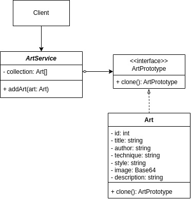

# 3.1.5. Prototype

## Introdução

Este documento apresenta a aplicação do padrão de projeto Prototype no desenvolvimento da Pinacoteca Online.

O padrão Prototype, classificado como um padrão criacional pelo Gang of Four (GoF), permite a criação de novos objetos a partir da clonagem de instâncias existentes, sem acoplar o código às classes concretas desses objetos (REFACTORING GURU, 2024). Essa abordagem possibilita agilizar o processo de criação, especialmente quando a instância de um objeto é complexa ou custosa de ser construída do zero.

No contexto deste projeto, embora não tenha sido identificado um cenário ideal para a aplicação prática desse padrão, sua utilização foi considerada com fins didáticos, visando exercitar e aprofundar o entendimento sobre o seu funcionamento e benefícios.

## Metodologia

Para o desenvolvimento do trabalho, foram realizadas as seguintes etapas:

1. Estudo do conteúdo: foi assistida a videoaula disponível no Aprender 3, complementada por pesquisas adicionais na internet para aprofundamento no tema.
2. Análise do diagrama de classes: após a compreensão do conteúdo, foi analisado onde o padrão Prototype poderia ser aplicado.
3. Adaptações: definido o alvo de aplicação, foram feitas as adaptações necessárias, detalhadas na seção de desenvolvimento, para viabilizar a implementação do padrão GoF Prototype.
4. Elaboração do diagrama: o diagrama referente ao padrão Prototype foi criado utilizando a plataforma draw.io.
5. Implementação do código: foi realizada a codificação conforme o diagrama elaborado e as adaptações feitas.
6. Elaboração do documento: o documento foi elaborado e aprimorado ao longo de todas as etapas anteriores, consolidando o processo.

## Desenvolvimento

Como descrito na metodologia, a aplicação do padrão GoF Prototype no contexto do projeto exigiu adaptações sobre o que já havia sido desenvolvido nas entregas anteriores. Vale ressaltar que essas alterações foram feitas exclusivamente para possibilitar a implementação do padrão com fins didáticos, não sendo mudanças permanentes na estrutura do projeto.

Essas adaptações se mostraram necessárias, pois, no contexto original, não havia justificativa prática para a aplicação do padrão Prototype. Isso porque o padrão Prototype permite a criação, clonagem, de novos objetos a partir de instâncias já existentes, realizando as modificações necessárias, apenas. Essa ferramenta é muito utilizada no contexto de jogos, onde é necessário instanciar rapidamente vários objetos, como NPCs ou inimigos, proporcionando uma experiência mais fluida para o jogador. No entanto, o escopo da pinacoteca online não apresenta elementos que justificassem a aplicação direta do padrão. Por esse motivo, foi criado um novo cenário que possibilitasse uma demonstração adequada do padrão.

No cenário adaptado proposto para o desenvolvimento da atividade, considerou-se o caso de um artista que deseja publicar várias obras de uma mesma coletânea. Esse processo pode ser otimizado ao permitir a submissão simultânea de várias artes, alterando apenas pequenos detalhes, como título, imagem e descrição, mas mantendo informações comuns, como autor, técnica utilizada, estilo, entre outros. Dessa forma, o padrão de projeto Prototype surge como uma solução eficaz para agilizar e otimizar esse processo.

### Diagrama

<font size="2"><p style="text-align: center"><b>Figura 1: </b>Diagrama de Classes criado para implementação do padrão Prototype</p></font>

<div style="text-align: center;">



</div>

<font size="2"><p style="text-align: center"><b>Autor:</b> <a href="https://github.com/leanars">Leandro Almeida</a>, 2025</p></font>

O diagrama detalha os seguintes componentes e seu fluxo de interação:

- **Client:** Representa qualquer consumidor das funcionalidades do serviço de arte, como um componente da interface do usuário que exibe detalhes de obras, um controlador que processa requisições, ou outra parte do sistema que necessita acessar informações de uma Art.
- **<< Interface >> ArtService:** Esta interface estabelece o contrato formal para todas as operações relacionadas à manipulação e recuperação de obras de arte.
- **RealArtService:** Esta é a implementação concreta e original da interface ArtService, contendo a lógica de negócio principal e mais custosa.
- **CachingArtProxy:** Desempenha o papel de "Proxy" do padrão. Esta classe também implementa a interface ArtService, posicionando-se como um substituto para o RealArtService do ponto de vista do Client.

### Código

#### Controller

```

import { Controller, Get, Post, Body, Param } from '@nestjs/common';
import { ArtService } from './art.service';
import { Art } from './art.entity';

@Controller('arts')
export class ArtController {
  constructor(private readonly artService: ArtService) {}

  @Post(':prototypeKey')
  createArtFromPrototype(
    @Param('prototypeKey') prototypeKey: string,
    @Body() body: { title: string; image: string; description: string },
  ): Art | null {
    const art = this.artService.createArtFromPrototype(
      prototypeKey,
      body.title,
      body.image,
      body.description,
    );
    if (art) {
      return this.artService.addArt(art);
    }
    return null;
  }

  @Get()
  listAllArts(): Art[] {
    return this.artService.listAllArts();
  }

  @Get(':id')
  getArt(@Param('id') id: number): Art | undefined {
    return this.artService.getArtById(id);
  }
}

```

#### Entity

```
// src/art/art.entity.ts

export interface ArtPrototype {
  clone(): Art;
}

export class Art implements ArtPrototype {
  public id: number | null = null;
  public title: string;
  public author: string;
  public technique: string;
  public style: string;
  public image: string;
  public description: string;
  public uploadedAt: Date;
  public updatedAt: Date | null = null;

  constructor(
    title = '',
    author = '',
    technique = '',
    style = '',
    image = '',
    description = ''
  ) {
    this.title = title;
    this.author = author;
    this.technique = technique;
    this.style = style;
    this.image = image;
    this.description = description;
    this.uploadedAt = new Date();
  }

  public clone(): Art {
    const newArt = new Art();
    newArt.title = this.title;
    newArt.author = this.author;
    newArt.technique = this.technique;
    newArt.style = this.style;
    newArt.image = this.image;
    newArt.description = this.description;
    newArt.uploadedAt = new Date();
    return newArt;
  }

  public showDetails(): void {
    console.log("--- Detalhes da Arte ---");
    console.log(`ID: ${this.id}`);
    console.log(`Título: ${this.title}`);
    console.log(`Autor: ${this.author}`);
    console.log(`Técnica: ${this.technique}`);
    console.log(`Estilo: ${this.style}`);
    console.log(`Descrição: ${this.description}`);
    console.log(`Tamanho da Imagem (Base64): ${this.image.length}`);
    console.log(`Data de Upload: ${this.uploadedAt.toLocaleDateString()}`);
  }
}

```

#### Module

```
// src/art/art.module.ts

import { Module } from '@nestjs/common';
import { ArtService } from './art.service';

@Module({
  providers: [ArtService],
  exports: [ArtService],
})
export class ArtModule {}

```

#### Service

```
// src/art/art.service.ts

import { Injectable } from '@nestjs/common';
import { Art } from './art.entity';

@Injectable()
export class ArtService {
  private collection: Art[] = [];
  private nextId = 1;
  private prototypeRegistry = new Map<string, Art>();

  constructor() {
    const defaultPrototype = new Art(
      '',
      'Artista Desconhecido',
      'Técnica Mista',
      'Moderno',
      '',
      'Descrição Padrão da Coletânea'
    );
    this.prototypeRegistry.set('defaultColetaneaArt', defaultPrototype);

    const regionalPrototype = new Art(
      '',
      'Artista Regional Brasileiro',
      'Artesanato Local',
      'Regional',
      '',
      'Arte inspirada na cultura regional brasileira.'
    );
    this.prototypeRegistry.set('regionalColetaneaArt', regionalPrototype);
  }

  addArt(art: Art): Art {
    art.id = this.nextId++;
    this.collection.push(art);
    console.log(`Arte "${art.title}" (ID: ${art.id}) adicionada com sucesso.`);
    return art;
  }

  createArtFromPrototype(
    prototypeKey: string,
    newTitle: string,
    newImageBase64: string,
    newDescription: string
  ): Art | null {
    const prototype = this.prototypeRegistry.get(prototypeKey);

    if (!prototype) {
      console.error(`Protótipo '${prototypeKey}' não encontrado.`);
      return null;
    }

    const newArt = prototype.clone();
    newArt.title = newTitle;
    newArt.image = newImageBase64;
    newArt.description = newDescription;

    return newArt;
  }

  getArtById(id: number): Art | undefined {
    return this.collection.find((art) => art.id === id);
  }

  listAllArts(): Art[] {
    return [...this.collection];
  }
}

```

### cliente

### module 

```
import { Module } from '@nestjs/common';
import { ClientService } from './client.service';
import { ArtModule } from '../art/art.module';

@Module({
  imports: [ArtModule],
  providers: [ClientService],
})
export class ClientModule {}
```
###service

```
// src/client/client.service.ts

import { Injectable, OnModuleInit } from '@nestjs/common';
import { ArtService } from '../art/art.service';

@Injectable()
export class ClientService implements OnModuleInit {
  constructor(private readonly artService: ArtService) {}

  onModuleInit() {
    console.log("\n--- Simulação de Uso do Prototype ---");

    const artPrototypeKey = 'regionalColetaneaArt';

    console.log("\nCriando primeira arte da coletânea regional...");
    const art1 = this.artService.createArtFromPrototype(
      artPrototypeKey,
      "Canto do Sabiá - Floresta Amazônica",
      "base64_imagem_sabiá...",
      "Uma representação vibrante do canto do sabiá na floresta tropical."
    );
    if (art1) {
      this.artService.addArt(art1);
      art1.showDetails();
    }

    console.log("\nCriando segunda arte da coletânea regional...");
    const art2 = this.artService.createArtFromPrototype(
      artPrototypeKey,
      "Festa Junina no Nordeste",
      "base64_imagem_festa_junina...",
      "Cenas típicas das celebrações juninas no interior do Nordeste brasileiro."
    );
    if (art2) {
      this.artService.addArt(art2);
      art2.showDetails();
    }

    console.log("\n--- Verificando a coleção final ---");
    this.artService.listAllArts().forEach((art) => art.showDetails());

    console.log("\n--- Verificando independência dos objetos ---");
    const storedArt1 = this.artService.getArtById(art1?.id || 0);
    const storedArt2 = this.artService.getArtById(art2?.id || 0);

    if (storedArt1 && storedArt2) {
      console.log(`Art 1 (Título): ${storedArt1.title}`);
      console.log(`Art 1 (Autor): ${storedArt1.author}`);
      console.log(`Art 2 (Título): ${storedArt2.title}`);
      console.log(`Art 2 (Autor): ${storedArt2.author}`);
      console.log(`Os objetos são diferentes? ${storedArt1 !== storedArt2}`);
    }
  }
}
```


### Main


```
// src/main.ts

import { NestFactory } from '@nestjs/core';
import { ClientModule } from './client/client.module';

async function bootstrap() {
  await NestFactory.createApplicationContext(ClientModule);
}
bootstrap();

```
## Demonstração do Código sendo Executado

- [Execução do Código](https://drive.google.com/file/d/1WvV537iRoQl3SD6QCPVpo1xMLoyDAUVe/view?usp=sharing)</br>
- Participantes: Mateus Cavalcante, Leandro Almeida


## Conclusão

Por fim, a aplicação do padrão Prototype na Pinacoteca Online, embora realizada de forma didática, demonstrou claramente os benefícios desse padrão na criação eficiente de objetos com propriedades compartilhadas. A atividade permitiu consolidar o entendimento sobre o funcionamento do Prototype e sua utilidade em cenários que demandam a clonagem de instâncias, mesmo que não tenha sido identificado um caso prático real no contexto do projeto.

## Bibliografia

> GAMMA, Erich; HELM, Richard; JOHNSON, Ralph; VLISSIDES, John. _Design Patterns: Elements of Reusable Object-Oriented Software_. Addison-Wesley, 1994.

> REFACTORING GURU. Prototype design pattern. Disponível em: <https://refactoring.guru/design-patterns/prototype>. Acesso em: 25 maio 2025.

## Histórico de Versões

| Versão | Data       | Descrição                                                                                                       | Autor(es)                                     | Revisor(es)             | Detalhes da revisão |
| ------ | ---------- | --------------------------------------------------------------------------------------------------------------- | --------------------------------------------- | ----------------------- | ------------------- |
| 1.0    | 25/05/2025 | Criação do documento, adição da introdução, metodologia, desenvolvimento e conclusão junto do diagrama e código | [Leandro Almeida](https://github.com/leanars) | [](https://github.com/) |                     |
| 1.0    | 25/05/2025 | Criação do documento, adição da introdução, metodologia, desenvolvimento e conclusão junto do diagrama e código | [Leandro Almeida](https://github.com/leanars) | [Alana Gabriele](https://github.com/alanagabriele) |                     |
| 1.1    | 30/05/2025 | Readaptação do Código                                                                                           | [Matheus Cavati]() | [Alana Gabriele](https://github.com/alanagabriele) |                     |
| 1.2    | 01/06/2025 | Ajustes na documentação                                                                                         | [Leandro Almeida](https://github.com/leanars) | [Alana Gabriele](https://github.com/alanagabriele) |                     |
| 1.3    | 01/06/2025 | ajuste do código | [mateus cavalcante](https://github.com/mateuscavati) | [Leandro Almeida](https://github.com/leanars) |                     |              |