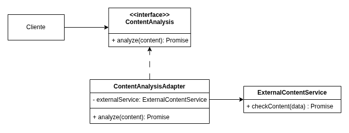

# 3.2.1. Padrão de Projeto GoF Estrutural - Adapter

## Introdução

Este documento apresenta o padrão de projeto estrutural **Adapter**, conforme descrito pelo _Gang of Four (GoF)_, e sua aplicação prática em um sistema de gerenciamento de usuários, artes e relatórios construído com NestJS e PostgreSQL.

O padrão Adapter tem como objetivo permitir a colaboração entre classes com interfaces incompatíveis, sem que seja necessário alterar o código existente. Ele atua como um "tradutor", possibilitando o reaproveitamento de código e a integração entre módulos antigos e novos.

## Metodologia

A construção deste trabalho seguiu os seguintes passos:

1. **Análise do cenário real do projeto**: um serviço de usuários (`UserService`) já implementado, com métodos como `createUser`, `editUser`, `deleteUser`.
2. **Identificação da necessidade de adaptação**: o módulo de relatórios (`Report`) requer uma interface diferente para acessar dados do usuário.
3. **Criação da interface esperada pelo módulo (`IReportUserService`)**.
4. **Criação de um adaptador (`UserServiceAdapter`)** que implementa essa interface, mas delega as chamadas ao `UserService`.
5. **Validação com código funcional dentro do ambiente NestJS e PostgreSQL.**

## Desenvolvimento

No sistema, o módulo de relatórios precisa obter informações de usuários usando uma interface mais enxuta e desacoplada. No entanto, o `UserService` expõe muitos métodos e lógica que não interessam ao `Report`.

Para isso, usamos o padrão Adapter. Abaixo estão os códigos que demonstram como o padrão foi aplicado:

### Interface esperada pelo módulo de relatório (`IReportUserService.ts`)

```ts
export interface IReportUserService {
  getUserSummaryById(userId: number): Promise<{ name: string; email: string }>;
}
```

### Serviço original (`user.service.ts`)

```ts
@Injectable()
export class UserService {
  async findUserById(userId: number): Promise<User> {
    // Busca o usuário no banco de dados (simplificação)
    return await prisma.user.findUnique({ where: { id: userId } });
  }

  async createUser(dto: CreateUserDto): Promise<User> {
    // Criação de usuário omitida
  }

  // Outros métodos omitidos
}
```

### Adaptador (`user-service.adapter.ts`)

```ts
import { Injectable } from "@nestjs/common";
import { IReportUserService } from "./interfaces/IReportUserService";
import { UserService } from "./user.service";

@Injectable()
export class UserServiceAdapter implements IReportUserService {
  constructor(private readonly userService: UserService) {}

  async getUserSummaryById(
    userId: number
  ): Promise<{ name: string; email: string }> {
    const user = await this.userService.findUserById(userId);
    return {
      name: user.name,
      email: user.email,
    };
  }
}
```

### Uso no módulo de relatório (`report.service.ts`)

```ts
@Injectable()
export class ReportService {
  constructor(
    @Inject("IReportUserService")
    private readonly userServiceAdapter: IReportUserService
  ) {}

  async createReportForUser(userId: number): Promise<void> {
    const userSummary = await this.userServiceAdapter.getUserSummaryById(
      userId
    );
    console.log(
      `Criando relatório para ${userSummary.name} (${userSummary.email})`
    );
    // Lógica para salvar relatório omitida
  }
}
```

### Registro no módulo (`app.module.ts` ou `report.module.ts`)

```ts
@Module({
  providers: [
    UserService,
    {
      provide: "IReportUserService",
      useClass: UserServiceAdapter,
    },
    ReportService,
  ],
})
export class ReportModule {}
```

Essa arquitetura promove o **baixo acoplamento** entre o módulo de relatórios e a lógica complexa do `UserService`, facilitando testes, manutenção e futuras alterações de implementação.

<font size="2"><p style="text-align: center"><b>Figura 1:</b> Diagrama de classes representando o padrão Adapter (GoF)</p></font>

<div style="text-align: center;">



</div>

<font size="2"><p style="text-align: center"><b>Autor:</b> <a href="https://refactoring.guru/pt-br/design-patterns/adapter">Refactoring Guru</a>, 2025</p></font>

## Conclusão

A implementação do padrão Adapter no contexto do nosso projeto demonstrou ser uma estratégia eficiente para promover reutilização de código, isolamento de dependências e organização de responsabilidades.

Através da interface `IReportUserService` e do adaptador `UserServiceAdapter`, conseguimos conectar o serviço de usuários ao módulo de relatórios sem acoplamento direto, seguindo boas práticas de design orientado a objetos.

Esse padrão é valioso especialmente em projetos grandes, nos quais mudanças em um serviço central podem gerar efeitos colaterais indesejados em múltiplos módulos.

## Gravação da Reunião

- [Vídeo 1: Título do vídeo.](https://drive.google.com)</br>
  Participantes: Fulano da Silva e Ciclano Rodrigues

## Bibliografia

> Refactoring Guru. _Adapter_. Disponível em: https://refactoring.guru/pt-br/design-patterns/adapter. Acesso em: 27 maio 2025.

> SERRANO, Milene. AULA - GOFS ESTRUTURAIS. Slides. Universidade de Brasília, 2025. Acesso em: 27 maio 2025.

> GAMMA, Erich; HELM, Richard; JOHNSON, Ralph; VLISSIDES, John. _Padrões de Projeto: Soluções reutilizáveis de software orientado a objetos_. Porto Alegre: Bookman, 2000.

## Histórico de Versões

| Versão | Data       | Descrição                                                   | Autor(es)                                                                             | Revisor(es)   | Detalhes da revisão |
| ------ | ---------- | ----------------------------------------------------------- | ------------------------------------------------------------------------------------- | ------------- | ------------------- |
| 1.0    | 27/05/2025 | Início do documento de um exemplo de Adapter para o projeto | [Felipe de Sousa](https://github.com/fsousac) e [Marllon](https://github.com/m4rllon) | <<Preencher>> | <<Preencher>>       |
