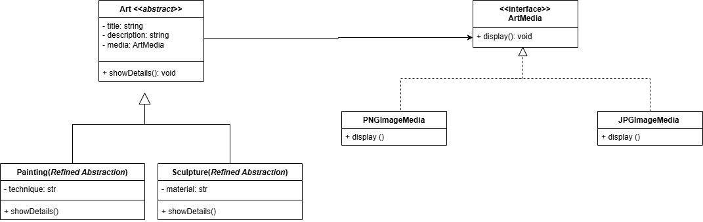

# 3.2.2 Bridge

## Introdução

O **Bridge** (também conhecido como *Ponte*) é um padrão de projeto estrutural cujo objetivo é desacoplar uma abstração de sua implementação, permitindo que ambas evoluam de forma independente. Ele resolve o problema da explosão de subclasses em hierarquias complexas, onde a combinação de múltiplas dimensões (como forma e cor, ou interface e plataforma) levaria a um crescimento exponencial de subclasses.[1]

Por exemplo, imagine uma classe `Forma` com subclasses `Círculo` e `Quadrado`, que precisa incorporar cores como `Vermelho` e `Azul`. Sem o Bridge, seria necessário criar subclasses como `CírculoVermelho`, `CírculoAzul`, `QuadradoVermelho`, etc. O padrão Bridge propõe extrair uma das dimensões (como a cor) para uma hierarquia separada, utilizando composição em vez de herança, o que proporciona maior flexibilidade e modularidade.[2]

O padrão Bridge tem os seguintes objetivos principais:

1. **Desacoplar abstração e implementação**: Permitir que a lógica de alto nível (abstração) e os detalhes de implementação sejam modificados sem impacto mútuo.
2. **Evitar explosão de classes**: Reduzir o número de subclasses necessárias ao separar dimensões ortogonais (independentes) em hierarquias distintas.
3. **Facilitar extensibilidade**: Permitir a adição de novas abstrações ou implementações sem alterar o código existente.
4. **Suportar trocas em tempo de execução**: Possibilitar a substituição dinâmica de implementações sem alterar a abstração.
5. **Promover modularidade**: Simplificar a manutenção e reduzir o risco de erros ao trabalhar com módulos independentes.

## Prós e Contras [2]

### Prós
- **Independência de plataforma**: Permite criar aplicações que funcionam em múltiplas plataformas sem acoplamento rígido.
- **Abstração de alto nível**: O código cliente interage apenas com abstrações, isolando-o dos detalhes de implementação.
- **Princípio Aberto/Fechado**: Facilita a introdução de novas abstrações e implementações sem modificar o código existente.
- **Princípio da Responsabilidade Única**: Separa a lógica de alto nível dos detalhes de implementação, promovendo maior coesão.
- **Flexibilidade em tempo de execução**: Permite trocar implementações dinamicamente, se necessário.

### Contras [2]
- **Complexidade adicional**: Em classes altamente coesas, o padrão pode introduzir complexidade desnecessária.
- **Curva de aprendizado**: A separação entre abstração e implementação pode ser confusa para desenvolvedores menos experientes.
- **Manutenção de hierarquias**: Gerenciar duas hierarquias separadas pode exigir esforço adicional em projetos simples.
- **Sobrecarga em casos simples**: Para problemas com uma única implementação, o padrão pode ser excessivo.

## Metodologia

Para a realização deste projeto, adotamos uma abordagem estruturada, empregando um conjunto de ferramentas e tecnologias para o desenvolvimento, documentação e validação do padrão Bridge. Abaixo estão listadas as ferramentas utilizadas e suas respectivas finalidades:

- **Draw.io**: Utilizado para a criação dos diagramas que ilustram a estrutura do padrão Bridge, facilitando a visualização da separação entre abstração e implementação e o relacionamento entre as classes.

- **Visual Studio Code (VSCode)**: Empregado como ambiente de desenvolvimento integrado (IDE) para escrita, edição e depuração do código-fonte.

- **YouTube**: Utilizado para gravar e compartilhar vídeos demonstrando o funcionamento do código implementado, permitindo a validação visual dos resultados.
- **Docsify**: Ferramenta usada para o desenvolvimento e geração da documentação do projeto, garantindo uma apresentação clara e acessível do conteúdo.
- **NestJS**: Framework principal utilizado para o desenvolvimento do backend, proporcionando uma arquitetura modular e escalável.
- **TypeScript**: Linguagem de programação adotada para garantir tipagem estática, aumentando a robustez e a manutenibilidade do código.

## Desenvolvimento

O desenvolvimento seguiu uma abordagem iterativa, iniciando pelo estudo aprofundado do padrão Bridge por meio das referências bibliográficas: Design Patterns: Elements of Reusable Object-Oriented Software (Gamma et al., 1995) e o artigo sobre Bridge do Refactoring Guru. Essas fontes foram fundamentais para compreender os conceitos teóricos do padrão, suas aplicações práticas e melhores estratégias de implementação, orientando a elaboração dos diagramas no Draw.io (conduzida por Renan e Danielle) e a implementação do código no VSCode com NestJS e TypeScript (conduzida por Renan e Danielle), além da redação da documentação no Docsify. Todo o processo de documentação foi desenvolvido de forma colaborativa, consolidando os aprendizados teóricos e práticos. Os resultados foram validados por meio de testes e gravações no YouTube, garantindo a correta aplicação do padrão Bridge.

Essa metodologia, fundamentada nas referências estudadas, assegurou a organização do projeto, a clareza na comunicação das ideias e a validação prática da implementação do padrão Bridge.

## Diagramas

<font size="2"><p style="text-align: center"><b>Figura 1 - Diagrama Bridge</b></p></font>

<center>



</center>

<font size="2"><p style="text-align: center"><b>Autores: Renan Araújo, Danielle Rodrigues, 2025</b></p></font>

## Código

#### [user.service](https://github.com/UnBArqDsw2025-1-Turma01/2025.1-T01-_G2_PinacotecaOnline_Entrega_03/blob/code-bridge/code-bridge/src/user.service.ts)

```ts
import { Injectable, Inject } from '@nestjs/common';

// Interface do Implementador para armazenamento de usuários
export interface UserStorageImplementor {
  saveUser(user: User): boolean;
}

// Implementador Concreto: Simula armazenamento local para usuários
@Injectable()
export class LocalUserStorage implements UserStorageImplementor {
  saveUser(user: User): boolean {
    try {
      console.log(`Usuário salvo: ${user.name} (${user.email})`);
      return true;
    } catch (error) {
      console.error('Erro ao salvar usuário no servidor.');
      return false;
    }
  }
}

// Entidade de Usuário
export interface User {
  name: string;
  email: string;
  password: string;
  description?: string;
  role: 'artist' | 'admin';
}

// Serviço de Usuários
@Injectable()
export class UserService {
  constructor(
    @Inject('UserStorageImplementor')
    private readonly implementor: UserStorageImplementor,
  ) {}

  // Registra um usuário (artista ou administrador)
  registerUser(user: User): boolean {
    if (!this.validateEmail(user.email) || !this.validatePassword(user.password)) {
      console.error('Erro: E-mail inválido ou senha fraca.');
      return false;
    }

    const success = this.implementor.saveUser(user);
    if (success) {
      if (user.role === 'artist') {
        console.log(`Artista registrado: ${user.name} com descrição: ${user.description || 'Sem descrição'}`);
      } else {
        console.log(`Administrador registrado: ${user.name} (${user.email})`);
      }
    }
    return success;
  }

  // Valida o formato do e-mail
  private validateEmail(email: string): boolean {
    const emailRegex = /^[^\s@]+@[^\s@]+\.[^\s@]+$/;
    return emailRegex.test(email);
  }

  // Verifica se a senha tem pelo menos 8 caracteres
  private validatePassword(password: string): boolean {
    return password.length >= 8;
  }
}
```

<font size="2"><p style="text-align: center"><b>Autores:</b> Renan Araújo, Danielle Rodrigues, 2025</p></font>

#### [user.module](https://github.com/UnBArqDsw2025-1-Turma01/2025.1-T01-_G2_PinacotecaOnline_Entrega_03/blob/code-bridge/code-bridge/src/user.module.ts)

```ts
import { Module } from '@nestjs/common';
import { UserService, LocalUserStorage } from './user.service';

@Module({
  providers: [
    UserService,
    {
      provide: 'UserStorageImplementor',
      useClass: LocalUserStorage,
    },
  ],
  exports: [UserService],
})
export class UserModule {}
```

<font size="2"><p style="text-align: center"><b>Autores:</b> Renan Araújo, Danielle Rodrigues, 2025</p></font>

#### [art.service](https://github.com/UnBArqDsw2025-1-Turma01/2025.1-T01-_G2_PinacotecaOnline_Entrega_03/blob/code-bridge/code-bridge/src/art.service.ts)

```ts
import { Injectable, Inject } from '@nestjs/common';
import { User } from './user.service';

// Interface do Implementador para exibição de artes
export interface ArtMedia {
  display(): string;
}

// Implementador Concreto: Exibição em formato PNG
@Injectable()
export class PNGImageMedia implements ArtMedia {
  display(): string {
    return 'Exibindo arte em formato PNG';
  }
}

// Implementador Concreto: Exibição em formato JPG
@Injectable()
export class JPGImageMedia implements ArtMedia {
  display(): string {
    return 'Exibindo arte em formato JPG';
  }
}

// Classe Abstrata: Arte
export abstract class Art {
  constructor(
    protected title: string,
    protected description: string,
    protected media: ArtMedia,
  ) {}

  abstract showDetails(): string;
}

// Abstração Refinada: Pintura
@Injectable()
export class Painting extends Art {
  constructor(
    title: string,
    description: string,
    media: ArtMedia,
    private technique: string,
  ) {
    super(title, description, media);
  }

  showDetails(): string {
    return `${this.title} (Pintura)\nDescrição: ${this.description}\nTécnica: ${this.technique}\n${this.media.display()}`;
  }
}

// Abstração Refinada: Escultura
@Injectable()
export class Sculpture extends Art {
  constructor(
    title: string,
    description: string,
    media: ArtMedia,
    private material: string,
  ) {
    super(title, description, media);
  }

  showDetails(): string {
    return `${this.title} (Escultura)\nDescrição: ${this.description}\nMaterial: ${this.material}\n${this.media.display()}`;
  }
}

// Serviço de Artes
@Injectable()
export class ArtService {
  constructor(
    @Inject('ArtMedia')
    private readonly mediaImplementor: ArtMedia,
  ) {}

  // Publica uma pintura associada a um usuário
  publishPainting(painting: { title: string; description?: string; technique: string }, user: User): boolean {
    if (user.role !== 'artist') {
      console.error('Erro: Apenas artistas podem publicar arte.');
      return false;
    }
    if (!painting.title || !painting.technique) {
      console.error('Erro: Título ou técnica não fornecidos.');
      return false;
    }
    const art = new Painting(painting.title, painting.description || 'Sem descrição', this.mediaImplementor, painting.technique);
    console.log(art.showDetails());
    return true;
  }

  // Publica uma escultura associada a um usuário
  publishSculpture(sculpture: { title: string; description?: string; material: string }, user: User): boolean {
    if (user.role !== 'artist') {
      console.error('Erro: Apenas artistas podem publicar arte.');
      return false;
    }
    if (!sculpture.title || !sculpture.material) {
      console.error('Erro: Título ou material não fornecidos.');
      return false;
    }
    const art = new Sculpture(sculpture.title, sculpture.description || 'Sem descrição', this.mediaImplementor, sculpture.material);
    console.log(art.showDetails());
    return true;
  }
}
```

<font size="2"><p style="text-align: center"><b>Autores:</b> Renan Araújo, Danielle Rodrigues, 2025</p></font>

#### [art.module](https://github.com/UnBArqDsw2025-1-Turma01/2025.1-T01-_G2_PinacotecaOnline_Entrega_03/blob/code-bridge/code-bridge/src/art.module.ts)

```ts
import { NestFactory } from '@nestjs/core';
import { AppModule } from './app.module';
import { UserService, User } from './user.service';
import { ArtService } from './art.service';

async function bootstrap() {
  const app = await NestFactory.createApplicationContext(AppModule);

  const userService = app.get(UserService);
  const artService = app.get(ArtService);

  const maria: User = {
    name: 'Maria',
    email: 'maria@email.com',
    password: 'securepassword123',
    description: 'Descrição de Maria',
    role: 'artist',
  };
  if (userService.registerUser(maria)) {
    artService.publishPainting(
      {
        title: 'Noite Estrelada',
        description: 'Uma pintura icônica de Van Gogh',
        technique: 'Óleo sobre tela',
      },
      maria,
    );
  }
  console.log('-----------------------------');

  userService.registerUser({
    name: 'Admin',
    email: 'admin@invalid',
    password: 'weak',
    role: 'admin',
  });
  console.log('-----------------------------');

  const validAdmin: User = {
    name: 'Admin Válido',
    email: 'admin.valido@email.com',
    password: 'adminpassword123',
    role: 'admin',
  };
  userService.registerUser(validAdmin);
  console.log('-----------------------------');

  const joao: User = {
    name: 'João',
    email: 'joao@email.com',
    password: 'securepassword123',
    description: 'Descrição de João',
    role: 'artist',
  };
  if (userService.registerUser(joao)) {
    artService.publishSculpture(
      {
        title: 'O Pensador',
        description: 'Uma escultura clássica de Rodin',
        material: 'Bronze',
      },
      joao,
    );
  }
  console.log('-----------------------------');

  await app.close();
}

bootstrap();
```

<font size="2"><p style="text-align: center"><b>Autores:</b> Renan Araújo, Danielle Rodrigues, 2025</p></font>

## Conclusão

A implementação do padrão Bridge em nosso projeto mostrou-se uma solução eficiente para desacoplar a lógica de exibição de artes das diferentes formas de armazenamento e apresentação de mídias. Utilizando interfaces bem definidas e a composição entre abstração e implementação, foi possível ampliar a flexibilidade do sistema e facilitar a manutenção.

Por exemplo, ao criar a interface `ArtMedia` e suas implementações concretas `PNGImageMedia` e `JPGImageMedia`, o sistema permite que cada obra de arte utilize qualquer formato de mídia sem alterar sua estrutura principal.

## Bibliografia

> [1] Gamma, Erich; Helm, Richard; Johnson, Ralph; Vlissides, John. _Padrões de projeto: soluções reutilizáveis de software orientado a objetos_. Tradução de Luiz A. Meirelles Salgado. Porto Alegre: Bookman, 2000.

> [2] Refactoring.Guru. _Padrão de Projeto Bridge_. Disponível em: <https://refactoring.guru/pt-br/design-patterns/bridge>. Acesso em: 29/05/2025.

> [3] SERRANO, Milene. Arquitetura e Desenho de Software - Aula - GoFs Estruturais. Disponível em: https://unbbr-my.sharepoint.com/:v:/g/personal/mileneserrano_unb_br/EdRWnnpbK8BJqcsgzvh1HRUBFjYsL1ncotuK486gTMhePA?e=t1Qd66 Acesso em: 31 maio 2025.

## Histórico de Versões


| Versão | Data       | Descrição                                                                                                                | Autor(es)                                                                                         | Revisor(es) | Detalhes da revisão |
| ------ | ---------- | ------------------------------------------------------------------------------------------------------------------------ | ------------------------------------------------------------------------------------------------- | ----------- | ------------------- |
| 1.0    | 29/05/2024 | Criação do documento, adição da introdução, metodologia, prós e contras e bibliografia. | [Renan Araújo](https://github.com/renantfm4), [Danielle Rodrigues](https://github.com/Danizelle) |   <<preencher>>    |         |
| 1.1    | 01/06/2024 | Adição do código  | [Renan Araújo](https://github.com/renantfm4), [Danielle Rodrigues](https://github.com/Danizelle) |<<preencher>> |            |
| 1.2    | 01/06/2024 | Adição da conclusão, diagrama, desenvolvimento e complemento da Bibliografia  | [Renan Araújo](https://github.com/renantfm4), [Danielle Rodrigues](https://github.com/Danizelle) |<<preencher>> |            |