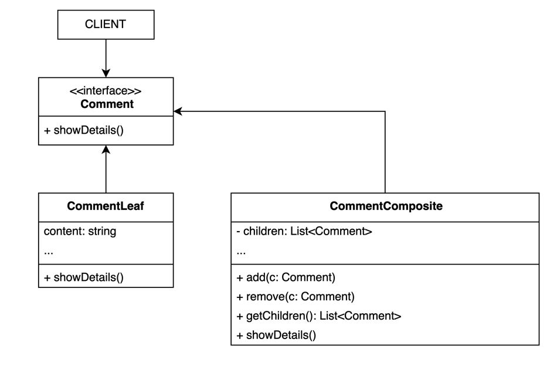
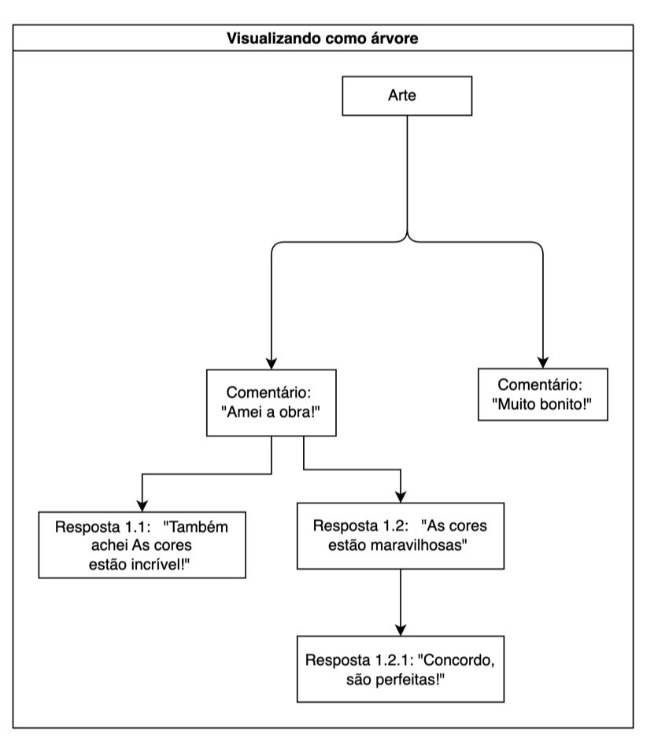

# 3.2.3 Composite

## Introdução

O Composite é um padrão de projeto da Gang of Four (GoF) pertencente ao grupo dos padrões Estruturais, cujo objetivo é compor objetos em estruturas de árvore para representar hierarquias parte-todo, permitindo que clientes tratem objetos individuais e composições de objetos de forma uniforme.

Esse padrão é especialmente útil quando há a necessidade de trabalhar com elementos que possuem uma hierarquia, onde objetos podem ser tanto simples quanto compostos por outros objetos. Isso permite que o sistema lide de maneira consistente com elementos individuais e agregados, simplificando a lógica do cliente.

## Metodologia

#### Para o desenvolvimento do Composite, foram adotadas as seguintes etapas metodológicas:

1. Foi elaborado um diagrama de classes que serviu como base para estruturar os elementos envolvidos no padrão, suas relações e hierarquias.

2. Como suporte teórico, foram utilizados os slides e as videoaulas disponibilizadas pela professora, que forneceram embasamento sobre o funcionamento, os princípios e os casos de uso do padrão Composite.

3. Também foi consultado o Guia de orientação indicado pela professora, que complementou o entendimento dos conceitos, boas práticas e requisitos para a construção do diagrama.

4. O diagrama foi modelado na ferramenta draw.io, permitindo uma visualização clara da composição dos objetos, seus relacionamentos e a hierarquia definida, de acordo com os princípios da UML.

## Desenvolvimento

O diagrama representa a estrutura de uma árvore de comentários associada a uma obra de arte. A obra é a raiz da árvore e organiza os comentários feitos pelos usuários. Cada comentário pode ser um elemento simples (folha) ou um elemento composto que agrupa respostas (subcomentários), formando uma hierarquia. Para fins didáticos, foi feita uma adaptação: no diagrama de classes original, comentários não aceitariam subcomentários, mas consideramos que aceitam, assim conseguimos aplicar o padrão Composite e deixar a estrutura mais completa.

<font size="2"><p style="text-align: center">Figura 1 - Diagrama Composite</p></font>

<center>



</center>

<font size="2"><p style="text-align: center">Autor(es): [Jésus Gabriel](https://github.com/xGabrielCv) & [Alana Gabriele](https://github.com/alanagabriele), 2025.</p></font>

<font size="2"><p style="text-align: center">Figura 2 - Exemplo de árvore</p></font>

<center>



</center>

<font size="2"><p style="text-align: center">Autor(es): [Jésus Gabriel](https://github.com/xGabrielCv) & [Alana Gabriele](https://github.com/alanagabriele), 2025.</p></font>

## Código

O código completo pode ser visualizado na branch [code-composite](https://github.com/UnBArqDsw2025-1-Turma01/2025.1-T01-_G2_PinacotecaOnline_Entrega_03/tree/code-composite).

### Vídeo

<font size="2"><p style="text-align: center">Vídeo 1 - Código composite</p></font>

<center>

<iframe width="560" height="315" src="https://www.youtube.com/embed/ZmEfYw2QVmE?si=5snkY4wJVMTWvFdH" title="YouTube video player" frameborder="0" allow="accelerometer; autoplay; clipboard-write; encrypted-media; gyroscope; picture-in-picture; web-share" referrerpolicy="strict-origin-when-cross-origin" allowfullscreen></iframe>

</center>

<font size="2"><p style="text-align: center">Autor: [Alana Gabriele](https://github.com/alanagabriele), 2025.</p></font>

### Composite

#### comment.interface.ts

```typescript
export interface Comment {
  showDetails(indent?: string): void;
}
```

#### comment.leaf.ts

```typescript
import { Comment } from "./comment.interface";

export class CommentLeaf implements Comment {
  constructor(private content: string) {}

  showDetails(indent: string = ""): void {
    console.log(`${indent}Comentário: ${this.content}`);
  }
}
```

#### comment.composite.ts

```typescript
import { Comment } from "./comment.interface";

export class CommentComposite implements Comment {
  private children: Comment[] = [];

  constructor(private content: string) {}

  add(comment: Comment): void {
    this.children.push(comment);
  }

  remove(comment: Comment): void {
    this.children = this.children.filter((c) => c !== comment);
  }

  getChildren(): Comment[] {
    return this.children;
  }

  showDetails(indent: string = ""): void {
    console.log(`${indent}Comentário: ${this.content}`);
    this.children.forEach((child) => child.showDetails(indent + "  "));
  }
}
```

## Conclusão

A aplicação do padrão Composite no projeto da Pinacoteca Online foi fundamental para estruturar a organização hierárquica das coleções de arte e seus respectivos itens. O padrão proporcionou uma abordagem flexível e escalável, permitindo que tanto obras individuais quanto agrupamentos de obras (coleções) fossem tratados de maneira uniforme. Isso simplificou a lógica do sistema, melhorou a manutenção e facilitou a expansão futura do projeto.

## Bibliografia

> 1. <a id="ref1"></a> Composite - Padrão Estrutural. Refactoring Guru. Disponível em: https://refactoring.guru/pt-br/design-patterns/composite. Acesso em: 31 de Maio de 2025.

> 2. <a id="ref2"></a> Gamma, Erich. Padrões de projetos: soluções reutilizáveis. Bookman editora, 2009.

> 3. <a id="ref3"></a> Gamma, E.; Helm, R.; Johnson, R.; Vlissides, J. Padrões de Projeto: Soluções Reutilizáveis de Software Orientado a Objetos. Tradução de Luiz A. Meirelles Salgado. Porto Alegre: Bookman, 2007.

> 4. <a id="ref4"></a> Composite Design Pattern - SourceMaking. Disponível em: https://sourcemaking.com/design_patterns/composite. Acesso em: 31 de Maio de 2025.

> 5. SERRANO, Milene. 08b - Video-Aula - DSW - GoFs - Estruturais - Composite. [S. l.]. 1 vídeo (aula de Arquitetura e Desenho de Software). Disponível em: https://unbbr-my.sharepoint.com/:v:/g/personal/mileneserrano_unb_br/ETbYrohUuU9DnWkIPgxjH2IBzbWEbavD-Fyk1ZWL8pK-lA?e=pmyF2R Acesso em: 31 maio 2025.

> 6. SERRANO, Milene. Arquitetura e Desenho de Software - Aula - GoFs Estruturais. Disponível em: https://unbbr-my.sharepoint.com/:v:/g/personal/mileneserrano_unb_br/EdRWnnpbK8BJqcsgzvh1HRUBFjYsL1ncotuK486gTMhePA?e=t1Qd66 Acesso em: 31 maio 2025.

## Histórico de Versões

| Versão | Data       | Descrição                                                                                                                | Autor(es)                                                                                         | Revisor(es) | Detalhes da revisão |
| ------ | ---------- | ------------------------------------------------------------------------------------------------------------------------ | ------------------------------------------------------------------------------------------------- | ----------- | ------------------- |
| 1.0    | 31/05/2024 | Criação do documento, modelagem inicial do diagrama e adição da introdução, metodologia, Bibliografia e Desenvolvimento. | [Jésus Gabriel](https://github.com/xGabrielCv) [Alana Gabriele](https://github.com/alanagabriele) |       [Davi Rodrigues](https://github.com/DaviRogs)      |         Foi analisado as imagens da modelagem, metodologia, desenvolvimento (parcial) e a bibliografia.            |
| 1.1    | 01/06/2024 | Adiçao do código e vídeo explicativo                                                                                     | [Jésus Gabriel](https://github.com/xGabrielCv) [Alana Gabriele](https://github.com/alanagabriele) |       [Davi Rodrigues](https://github.com/DaviRogs)    |           Foi analisado os códigos adicionados, juntamente com o vídeo explicativo          |
