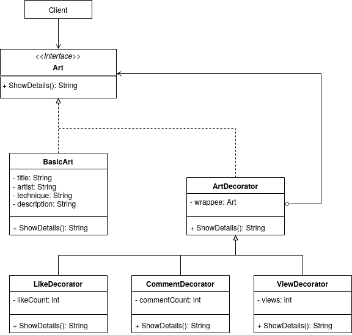

# 3.2.4. Decorator

## Introdução

Este documento apresenta a aplicação do padrão de projeto Decorator no desenvolvimento da **Pinacoteca Online**.

O padrão Decorator, classificado como um padrão estrutural pelo *Gang of Four* (GoF), permite adicionar responsabilidades adicionais a um objeto de forma dinâmica, sem modificar sua estrutura original (REFACTORING GURU, 2024). Essa abordagem promove maior flexibilidade em relação ao uso da herança, pois permite compor funcionalidades de maneira incremental, por meio do encapsulamento de objetos decorados.

No contexto deste projeto, o padrão foi utilizado para enriquecer a exibição de obras de arte com informações adicionais, como número de curtidas, comentários e visualizações. Com isso, foi possível estender o comportamento da interface de exibição sem alterar a classe base que representa a obra de arte, promovendo maior reutilização de código e aderência ao princípio aberto/fechado (*Open/Closed Principle*) da programação orientada a objetos.

## Metodologia

Para o desenvolvimento do trabalho, foram realizadas as seguintes etapas:

1. Estudo do conteúdo: foi assistida a videoaula disponível no Aprender 3, complementada por pesquisas adicionais na internet para aprofundamento no tema.
2. Análise do diagrama de classes: após a compreensão do conteúdo, foi analisado onde o padrão Decorator poderia ser aplicado.
3. Adaptações: definido o alvo de aplicação, foram feitas as adaptações necessárias, detalhadas na seção de desenvolvimento, para viabilizar a implementação do padrão GoF Decorator.
4. Elaboração do diagrama: o diagrama referente ao padrão Decorator foi criado utilizando a plataforma draw.io.
5. Implementação do código: foi realizada a codificação conforme o diagrama elaborado e as adaptações feitas com auxílio de IA.
6. Elaboração do documento: o documento foi elaborado e aprimorado ao longo de todas as etapas anteriores, consolidando o processo.

## Desenvolvimento

Como descrito na metodologia, a aplicação do padrão GoF **Decorator** no contexto do projeto exigiu algumas adaptações na estrutura previamente desenvolvida. Tais alterações foram propostas com fins didáticos, com o objetivo de ilustrar o funcionamento e os benefícios desse padrão, sem implicar necessariamente em mudanças definitivas no sistema.

O padrão Decorator se mostrou apropriado para representar a exibição de obras de arte com informações adicionais que variam conforme o contexto, como número de curtidas, comentários e visualizações. A alternativa tradicional, baseada em herança, exigiria a criação de múltiplas subclasses para cobrir todas as combinações possíveis de informações exibidas, resultando em um código rígido e de difícil manutenção. Por isso, o uso de decoradores foi mais vantajoso, permitindo a composição dinâmica dessas funcionalidades.

Para implementar o padrão, foi criada uma interface comum chamada `Art`, representando a estrutura base de exibição de uma obra. A partir dela, uma classe concreta `BasicArt` fornece as informações fundamentais, como **título**, **artista**, **técnica** e **descrição**. Em seguida, foram desenvolados decoradores como `LikeDecorator`, `CommentDecorator` e `ViewDecorator`, todos herdando de uma classe abstrata `ArtDecorator`, responsável por encapsular outro objeto do tipo `Art`. Cada decorador adiciona comportamentos específicos ao método `showDetails()`, sem alterar o funcionamento da obra original.

Na prática, essa abordagem permite que o sistema exiba dinamicamente uma obra com diferentes níveis de detalhamento, dependendo das preferências do usuário ou do contexto de exibição. Por exemplo, uma obra pode ser apresentada apenas com curtidas, ou com curtidas e comentários, ou ainda com todas as informações adicionais, bastando encadear os decoradores conforme necessário.

Esse exercício reforça os princípios de composição sobre herança e promove um código mais flexível, reutilizável e aderente ao paradigma da programação orientada a objetos.

### Diagrama

<font size="2"><p style="text-align: center"><b>Figura 1: </b>Diagrama criado para implementação do padrão Decorator</p></font>

<div style="text-align: center;">



</div>

<font size="2"><p style="text-align: center"><b>Autor:</b> <a href="https://github.com/DaviRogs">Davi Rodrigues</a>, 2025</p></font>

### Código

####  Interface `Art`
```ts
// art.interface.ts
export interface Art {
  showDetails(): string;
}
```

####  Classe Concreta `BasicArt`
```ts
// basic-art.ts
import { Art } from './art.interface';

export class BasicArt implements Art {
  constructor(
    private title: string,
    private artist: string,
    private technique: string,
    private description: string,
  ) {}

  showDetails(): string {
    return `🎨 ${this.title} por ${this.artist} (${this.technique})\n${this.description}`;
  }
}


```

#### Classe Abstrata `ArtDecorator`
```ts
// art.decorator.ts
import { Art } from './art.interface';

export abstract class ArtDecorator implements Art {
  constructor(protected wrappee: Art) {}

  abstract showDetails(): string;
}
```

#### Decorador Concreto `LikeDecorator`
```ts
// like.decorator.ts
import { ArtDecorator } from './art.decorator';

export class LikeDecorator extends ArtDecorator {
  constructor(wrappee, private likeCount: number) {
    super(wrappee);
  }

  showDetails(): string {
    return `${this.wrappee.showDetails()}\n❤️ Curtidas: ${this.likeCount}`;
  }
}
```

#### Decorador Concreto `CommentDecorator`
```ts
// comment.decorator.ts
import { ArtDecorator } from './art.decorator';

export class CommentDecorator extends ArtDecorator {
  constructor(wrappee, private commentCount: number) {
    super(wrappee);
  }

  showDetails(): string {
    return `${this.wrappee.showDetails()}\n💬 Comentários: ${this.commentCount}`;
  }
}
```
#### Decorador Concreto `ViewDecorator`
```ts
// view.decorator.ts
import { ArtDecorator } from './art.decorator';

export class ViewDecorator extends ArtDecorator {
  constructor(wrappee, private views: number) {
    super(wrappee);
  }

  showDetails(): string {
    return `${this.wrappee.showDetails()}\n👁️ Visualizações: ${this.views}`;
  }
}
```

#### Main
```ts
// service.ts
import { BasicArt } from './basic-art';
import { LikeDecorator } from './like.decorator';
import { CommentDecorator } from './comment.decorator';
import { ViewDecorator } from './view.decorator';

const art = new BasicArt('Céu Azul', 'Mayumi', 'Aquarela', 'Uma paisagem serena e azulada.');

const decorated = new ViewDecorator(
  new CommentDecorator(
    new LikeDecorator(art, 120),
    42
  ),
  830
);

console.log(decorated.showDetails());
```

#### Informações adicionais

- [Código rodando](https://drive.google.com/file/d/1ojz7e1NoY-4rSd-wkz3DtMzzKsJqpZF4/view?usp=drive_link)<br>
  Participantes: Davi Rodrigues da Rocha
- [Repositório do Código](https://github.com/UnBArqDsw2025-1-Turma01/2025.1-T01-_G2_PinacotecaOnline_Entrega_03/tree/code-decorator)

## Conclusão

Por fim, a aplicação do padrão Decorator na Pinacoteca Online, ainda que realizada com fins didáticos, evidenciou as vantagens da composição dinâmica de comportamentos em relação à herança rígida. Através do uso de decoradores, foi possível estender funcionalidades de exibição de obras de arte — como curtidas, comentários e visualizações — de forma flexível e modular, sem modificar a estrutura original das classes existentes.

A atividade contribuiu para entender o padrão Decorator, mostrando sua aplicabilidade em situações onde diferentes funcionalidades precisam ser combinadas de maneira independente. Mesmo que o cenário adotado tenha sido construído para fins pedagógicos, ele demonstrou com clareza como o padrão Decorator pode tornar o código mais reutilizável, organizado e aderente aos princípios de design orientado a objetos.

## Bibliografia

> REFACTORING GURU. Prototype design pattern. Disponível em: <https://refactoring.guru/design-patterns/prototype>. Acesso em: 31 maio 2025.

> SERRANO, Milene. 09d - Video-Aula - DSW - GoFs - Estruturais - Demais Padrões - Visões Rápida. [S. l.]. 1 vídeo (aula de Arquitetura e Desenho de Software). Disponível em: https://unbbr-my.sharepoint.com/:v:/g/personal/mileneserrano_unb_br/EZzj0BVtpTxMnBCtiUlE0r8BD7Tw_XOeK1J8Jn__qgod0A?e=ic6AcE&nav=eyJyZWZlcnJhbEluZm8iOnsicmVmZXJyYWxBcHAiOiJTdHJlYW1XZWJBcHAiLCJyZWZlcnJhbFZpZXciOiJTaGFyZURpYWxvZy1MaW5rIiwicmVmZXJyYWxBcHBQbGF0Zm9ybSI6IldlYiIsInJlZmVycmFsTW9kZSI6InZpZXcifX0%3D. Acesso em: 31 maio 2025.

> SERRANO, Milene. Arquitetura e Desenho de Software - Aula - GoFs Estruturais. Disponível em: https://aprender3.unb.br/pluginfile.php/3075186/mod_page/content/1/Arquitetura%20e%20Desenho%20de%20Software%20-%20Aula%20GoFs%20Estruturais%20-%20Profa.%20Milene.pdf. Acesso em: 31 maio 2025.

## Histórico de Versões

| Versão | Data       | Descrição                                                                                                       | Autor(es)                                     | Revisor(es)             | Detalhes da revisão |
| ------ | ---------- | --------------------------------------------------------------------------------------------------------------- | --------------------------------------------- | ----------------------- | ------------------- |
| 1.0    | 31/05/2025 | Criação do documento, adição da introdução e desenvolvimento. | [Davi Rodrigues](https://github.com/DaviRogs) | [Alana Gabriele](https://github.com/alanagabriele) |                     |
| 1.1    | 31/05/2025 | Adição do Código a partir do diagrama feito, conclusão e bibliografia. | [Lucas Heler](https://github.com/Akaeboshi) |[Alana Gabriele](https://github.com/alanagabriele) |    O artefato foi revisado e não foram identificados problemas.                 |
