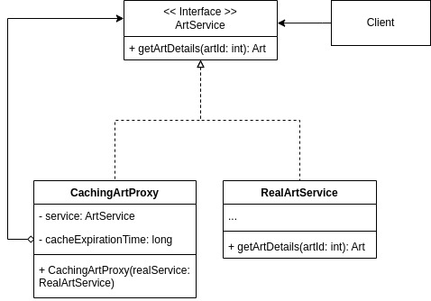

# 3.2.5. Proxy

## Introdução

Este documento apresenta a aplicação do padrão de projeto Proxy no desenvolvimento da Pinacoteca Online.

O padrão Proxy, classificado como um padrão estrutural pelo Gang of Four (GoF), tem como objetivo fornecer um substituto ou representante de outro objeto, controlando o acesso a ele (REFACTORING GURU, 2024). Essa abordagem permite adicionar uma camada intermediária para realizar funções adicionais, como controle de acesso, criação tardia, cache ou registro de logs, sem alterar o objeto real.

## Metodologia

Para o desenvolvimento do trabalho, foram realizadas as seguintes etapas:

1. Estudo do conteúdo: foi assistida a videoaula disponível no Aprender 3, complementada por pesquisas adicionais na internet para aprofundamento no tema.
2. Análise do diagrama de classes: após a compreensão do conteúdo, foi analisado onde o padrão Proxy poderia ser aplicado.
3. Elaboração do diagrama: o diagrama referente ao padrão Proxy foi criado utilizando a plataforma draw.io.
<!-- 4. Implementação do código: foi realizada a codificação conforme o diagrama elaborado. -->
4. Elaboração do documento: o documento foi elaborado e aprimorado ao longo de todas as etapas anteriores, consolidando o processo.

## Desenvolvimento

Ao analisar o diagrama de classes e as necessidades da aplicação, identificou-se que a consulta frequente aos detalhes de obras de arte poderia causar uma sobrecarga no sistema, devido ao alto custo associado às requisições de dados. Para mitigar esse problema, verificou-se que a adoção do padrão Proxy de Cache seria uma solução adequada.

O Proxy de Cache funciona como uma camada intermediária que armazena, em memória, os resultados de consultas realizadas com frequência. Assim, em vez de acessar o banco de dados a cada solicitação de detalhes de uma obra, o proxy verifica se a informação já está disponível em seu cache. Esse mecanismo proporciona uma melhora significativa na velocidade de resposta e reduz consideravelmente a carga sobre a infraestrutura do banco de dados.

O diagrama a seguir ilustra a lógica de implementação:

### Diagrama

<font size="2"><p style="text-align: center"><b>Figura 1:</b> Diagrama de Classes que ilustra aplicação do padrão Proxy</p></font>

<div style="text-align: center;">



</div>

<font size="2"><p style="text-align: center"><b>Autor:</b> <a href="https://github.com/leanars">Leandro Almeida</a>, 2025</p></font>

O diagrama detalha os seguintes componentes e seu fluxo de interação:

- **Client (Cliente):**
  Representa qualquer parte do sistema (como a interface do usuário ou um controlador) que necessita obter os detalhes de uma obra de arte. O Client interage apenas com a interface ArtService, sem ter conhecimento da implementação subjacente (se é o serviço real ou um proxy), garantindo um alto nível de desacoplamento.

- **<< Interface >> ArtService:**
  Define o contrato para as operações relacionadas às obras de arte. Neste diagrama, o método principal é getArtDetails(artId: int): Art, que especifica que o serviço deve ser capaz de retornar um objeto Art com base em seu identificador. Tanto o serviço real quanto o proxy implementarão esta interface, assegurando que ambos possam ser usados de forma intercambiável pelo Client.

- **RealArtService:**
  Esta classe é a implementação concreta da interface ArtService e contém a lógica de negócio principal. Sua responsabilidade é realizar a operação "pesada" de buscar os detalhes de uma obra de arte diretamente do banco de dados. Quando o RealArtService.getArtDetails(artId) é invocado, ele executa as consultas complexas e acessos a dados necessários para construir e retornar o objeto Art completo.

- **CachingArtProxy:**
  Esta é a peça central do padrão Proxy de Cache. Também implementa a interface ArtService, permitindo que o Client interaja com ela como se fosse o RealArtService. O CachingArtProxy possui uma referência (service: ArtService ou realService: RealArtService) para uma instância do RealArtService.

### art

### controller
```
import { Controller, Get, Param, Post, Body, NotFoundException } from '@nestjs/common';
import { CachingArtProxy } from './caching-art.proxy';
import { CreateArtDto } from './create-art.dto';
import { Art } from './art.entity';

@Controller('arts')
export class ArtController {
  constructor(private readonly artService: CachingArtProxy) {}

  @Get()
  async findAll(): Promise<Art[]> {
    return this.artService.listAllArts();
  }

  @Get(':id')
  async findById(@Param('id') id: string): Promise<Art> {
    const artId = parseInt(id, 10);
    try {
      return await this.artService.getArtDetails(artId);
    } catch (err) {
      throw new NotFoundException(err.message);
    }
  }

  @Post()
  async create(@Body() createArtDto: CreateArtDto): Promise<Art> {
    const art = new Art(createArtDto);
    return this.artService.addArt(art);
  }
}
```

### Entity
```
export class Art {
  id: number | null = null;
  title: string = '';
  author: string = '';
  technique: string = '';
  style: string = '';
  image: string = '';
  description: string = '';
  uploadedAt: Date = new Date();
  updatedAt: Date | null = null;

  constructor(init?: Partial<Art>) {
    Object.assign(this, init);
  }
}
```
### Module
```
import { Module } from '@nestjs/common';
import { ArtController } from './art.controller';
import { RealArtService } from './real-art.service';
import { CachingArtProxy } from './caching-art.proxy';

@Module({
  controllers: [ArtController],
  providers: [
    RealArtService,
    {
      provide: CachingArtProxy,
      useFactory: (realService: RealArtService) => new CachingArtProxy(realService),
      inject: [RealArtService],
    },
  ],
})
export class ArtModule {}
```
### caching art proxy
```
import { Injectable } from '@nestjs/common';
import { RealArtService } from './real-art.service';
import { Art } from './art.entity';

@Injectable()
export class CachingArtProxy {
  private cache = new Map<number, Art>();

  constructor(private readonly realService: RealArtService) {}

  async getArtDetails(artId: number): Promise<Art> {
    if (this.cache.has(artId)) {
      console.log('Cache hit:', artId);
      return this.cache.get(artId)!;
    }

    console.log('Cache miss:', artId);
    const art = await this.realService.getArtDetails(artId);
    this.cache.set(artId, art);
    return art;
  }

  async addArt(art: Art): Promise<Art> {
    const addedArt = await this.realService.addArt(art);
    this.cache.set(addedArt.id!, addedArt);
    return addedArt;
  }

  async listAllArts(): Promise<Art[]> {
    return this.realService.listAllArts();
  }
}
```
### create art
```
export class CreateArtDto {
  title: string;
  author: string;
  technique: string;
  style: string;
  image: string;
  description: string;
}
```
real art service
```
import { Injectable } from '@nestjs/common';
import { Art } from './art.entity';

@Injectable()
export class RealArtService {
  private mockDb: Art[] = [];
  private nextId = 1;

  async getArtDetails(artId: number): Promise<Art> {
    const art = this.mockDb.find((a) => a.id === artId);
    if (!art) {
      throw new Error(`Arte com ID ${artId} não encontrada.`);
    }
    return art;
  }

  async addArt(art: Art): Promise<Art> {
    art.id = this.nextId++;
    art.uploadedAt = new Date();
    this.mockDb.push(art);
    return art;
  }

  async listAllArts(): Promise<Art[]> {
    return this.mockDb;
  }
}
```
### app module
```
import { Module } from '@nestjs/common';
import { ArtModule } from './art/art.module';

@Module({
  imports: [ArtModule],
})
export class AppModule {}

```

### main

```
import { NestFactory } from '@nestjs/core';
import { AppModule } from './app.module';

async function bootstrap() {
  const app = await NestFactory.create(AppModule);
  await app.listen(3000);
  console.log('App listening on http://localhost:3000');
}
bootstrap();
```

<!-- ADICIONAR -->
## Demonstração do Código sendo Executado

- [Execução do Código](https://drive.google.com/file/d/1YeeWteJFQ48AYtYB0GTCVJ1jC5ChDbqW/view?usp=sharing)</br>
  Participantes: Mateus Cavalcante e Leandro almeida
  - [Repositório do Código](https://github.com/UnBArqDsw2025-1-Turma01/2025.1-T01-_G2_PinacotecaOnline_Entrega_03/tree/code-proxy)

## Conclusão

Este documento demonstrou a aplicação do padrão Proxy de Cache na Pinacoteca Online. Essa abordagem demonstrou como a otimização do acesso aos detalhes das obras de arte utilizando proxy poderia resultar em uma melhor performance, menor sobrecarga do banco de dados e maior escalabilidade da plataforma.

## Bibliografia

> GAMMA, Erich; HELM, Richard; JOHNSON, Ralph; VLISSIDES, John. _Design Patterns: Elements of Reusable Object-Oriented Software_. Addison-Wesley, 1994.

> REFACTORING GURU. Proxy design pattern. Disponível em: <https://refactoring.guru/design-patterns/proxy>. Acesso em: 25 maio 2025.

## Histórico de Versões

| Versão | Data       | Descrição                                                                                                                | Autor(es)                                     | Revisor(es)             | Detalhes da revisão |
| ------ | ---------- | ------------------------------------------------------------------------------------------------------------------------ | --------------------------------------------- | ----------------------- | ------------------- |
| 1.0    | 30/05/2025 | Adição da introdução, metodologia, diagrama e texto explicativo do diagrama, além das referências utilizadas e conclusão | [Leandro Almeida](https://github.com/leanars) | [Alana Gabriele](https://github.com/alanagabriele) |       
| 1.1    | 01/06/2025 | Adição do código | [mateus cavalcante](https://github.com/mateuscavati) | [Leandro Almeida](https://github.com/leanars) |                     |              |
