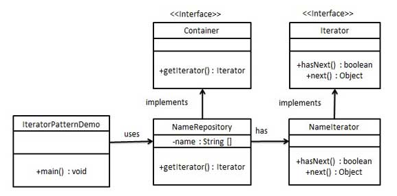
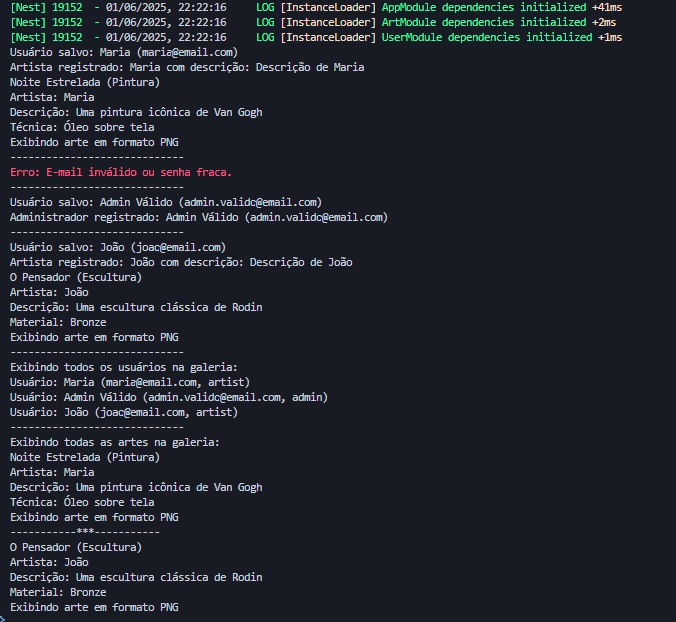

# 3.3.2. Iterator

## Introdução

O padrão comportamental Iterator, também conhecido como Cursor, tem como intuito fornecer um meio de acessar, sequencialmente, os elementos de um objeto agregado sem expor a sua representação subjacente [2]. Em outras palavras, ele retira a lógica de percorrimento da coleção e a encapsula em um objeto dedicado o iterador, permitindo que diferentes estruturas de dados sejam navegadas de forma uniforme e segura. 


O objetivo é isolar a lógica de travessia em um objeto independente, padronizando o acesso a qualquer coleção por meio de uma interface comum. Com isso, o Iterator:  

- possibilita múltiplos algoritmos de percorrimento sobre a mesma coleção;  
- permite percursos simultâneos e independentes, pois cada iterador mantém seu próprio estado;  
- facilita a introdução de novos tipos de iteração sem alterar a coleção nem o código cliente [1].  

O padrão Iterator oferece diversos benefícios no desenvolvimento de sistemas orientados a objetos, entre eles: [1]

- **Modularidade e coesão**: promove o princípio da responsabilidade única ao separar a lógica de travessia das coleções e do código cliente, facilitando a manutenção e organização do sistema.

- **Facilidade de extensão**: segue o princípio aberto/fechado, permitindo a criação de novas coleções e iteradores sem necessidade de modificar o código existente.

- **Iteração simultânea independente**: possibilita percursos paralelos sobre a mesma coleção, já que cada iterador armazena seu próprio estado de navegação.

- **Controle flexível da iteração**: permite interromper e retomar o processo de travessia, o que é útil em fluxos que exigem iteração sob demanda ou condicional. 

## Metodologia

Para a realização deste projeto, foi adotada uma abordagem estruturada, com o uso de ferramentas específicas voltadas para o desenvolvimento, documentação e validação do padrão de projeto Iterator. A seguir, estão descritas as ferramentas utilizadas e suas respectivas finalidades:

- **Draw.io**: utilizado para a elaboração dos diagramas que representam a estrutura e a interação entre os elementos do padrão Iterator, facilitando a visualização da separação entre a coleção e o iterador.

- **Visual Studio Code (VSCode)**: empregado como ambiente de desenvolvimento integrado (IDE) para a escrita, organização e depuração do código-fonte.

- **YouTube**: utilizado como meio de gravação e compartilhamento de vídeos demonstrativos do funcionamento da implementação, permitindo a validação visual dos comportamentos esperados do iterador.

- **Docsify**: ferramenta adotada para a construção e publicação da documentação do projeto, contribuindo para a apresentação clara e acessível do conteúdo desenvolvido.

- **NestJS**: framework utilizado no desenvolvimento da aplicação, organizando a arquitetura do backend de forma modular.

- **TypeScript**: linguagem de programação escolhida para garantir maior segurança e legibilidade por meio de tipagem estática.


## Desenvolvimento

O desenvolvimento do projeto seguiu uma abordagem iterativa, tendo início com o estudo aprofundado do padrão Iterator, com base nas obras Design Patterns: Elements of Reusable Object-Oriented Software (Gamma et al., 1995) e no artigo Iterator da plataforma Refactoring Guru. Essas referências forneceram embasamento teórico essencial para compreender o funcionamento do padrão, suas motivações e formas de aplicação em diferentes contextos.

A partir desse estudo, foram elaborados os diagramas conceituais no Draw.io por Danielle, utilizando como modelo a Figura 1 - Design Patterns - Iterator Pattern Modelo, e implementado o código utilizando NestJS e TypeScript por Renan, enquanto a documentação foi desenvolvida de forma colaborativa e paralela na plataforma Docsify. Os testes de validação foram realizados e registrados em vídeo, demonstrando o correto comportamento da travessia sobre coleções por meio de iteradores independentes e encapsulados.

Essa metodologia garantiu não apenas a organização e clareza na construção do projeto, mas também a fidelidade à aplicação do padrão Iterator, consolidando os aprendizados teóricos por meio da prática.


<font size="2"><p style="text-align: center"><b>Figura 1 - Design Patterns - Iterator Pattern Modelo</b></p></font>

<center>



</center>

<font size="2"><p style="text-align: center"><b>Fonte: Design Patterns - Iterator Pattern. tutorialspoint. Disponível em: https://www.tutorialspoint.com/design_pattern/iterator_pattern.htm. Acesso em: 01 de jun. de 2025.</b></p></font>

## Diagrama

<font size="2"><p style="text-align: center"><b>Figura 2 - Diagrama Iterator</b></p></font>

<center>

.png)

</center>

<font size="2"><p style="text-align: center"><b>Autores: [Renan Araújo](https://github.com/renantfm4) & [Danielle Rodrigues](https://github.com/Danizelle), 2025.</b></p></font>

### Código

#### [user.service](https://github.com/UnBArqDsw2025-1-Turma01/2025.1-T01-_G2_PinacotecaOnline_Entrega_03/blob/code-iterator/code-iterator/src/user.service.ts)

```ts
import { Injectable, Inject } from '@nestjs/common';

// Interface do Implementador para armazenamento de usuários
export interface UserStorageImplementor {
  saveUser(user: User): boolean;
}

// Interface para o Iterator de Usuários
export interface UserIterator {
  next(): User | null;
  hasNext(): boolean;
}

// Interface para a coleção de usuários
export interface UserCollection {
  getIterator(): UserIterator;
}

// Implementador Concreto: Simula armazenamento local para usuários
@Injectable()
export class LocalUserStorage implements UserStorageImplementor {
  saveUser(user: User): boolean {
    try {
      console.log(`Usuário salvo: ${user.name} (${user.email})`);
      return true;
    } catch (error) {
      console.error('Erro ao salvar usuário no servidor.');
      return false;
    }
  }
}

// Entidade de Usuário
export interface User {
  name: string;
  email: string;
  password: string;
  description?: string;
  role: 'artist' | 'admin';
}

// Implementação do Iterator Concreto para Usuários (não injetável)
export class UserGalleryIterator implements UserIterator {
  private index: number = 0;

  constructor(private users: User[]) {}

  next(): User | null {
    if (this.hasNext()) {
      return this.users[this.index++];
    }
    return null;
  }

  hasNext(): boolean {
    return this.index < this.users.length;
  }
}

// Implementação da Coleção de Usuários
@Injectable()
export class UserGallery implements UserCollection {
  private users: User[] = [];

  constructor(
    @Inject('UserStorageImplementor')
    private readonly implementor: UserStorageImplementor,
  ) {}

  addUser(user: User): boolean {
    if (!this.validateEmail(user.email) || !this.validatePassword(user.password)) {
      console.error('Erro: E-mail inválido ou senha fraca.');
      return false;
    }

    const success = this.implementor.saveUser(user);
    if (success) {
      this.users.push(user);
      if (user.role === 'artist') {
        console.log(`Artista registrado: ${user.name} com descrição: ${user.description || 'Sem descrição'}`);
      } else {
        console.log(`Administrador registrado: ${user.name} (${user.email})`);
      }
    }
    return success;
  }

  getIterator(): UserIterator {
    return new UserGalleryIterator(this.users);
  }

  // Valida o formato do e-mail
  private validateEmail(email: string): boolean {
    const emailRegex = /^[^\s@]+@[^\s@]+\.[^\s@]+$/;
    return emailRegex.test(email);
  }

  // Verifica se a senha tem pelo menos 8 caracteres
  private validatePassword(password: string): boolean {
    return password.length >= 8;
  }
}

// Serviço de Usuários
@Injectable()
export class UserService {
  constructor(
    @Inject('UserStorageImplementor')
    private readonly implementor: UserStorageImplementor,
  ) {}

  // Cria uma galeria para gerenciar os usuários
  createUserGallery(): UserGallery {
    return new UserGallery(this.implementor);
  }
}
```

<font size="2"><p style="text-align: center"><b>Autores:</b> Renan Araújo, Danielle Rodrigues, 2025</p></font>


#### [user.module](https://github.com/UnBArqDsw2025-1-Turma01/2025.1-T01-_G2_PinacotecaOnline_Entrega_03/blob/code-iterator/code-iterator/src/user.module.ts)

```ts
import { Module } from '@nestjs/common';
import { UserService, LocalUserStorage, UserGallery } from './user.service';

@Module({
  providers: [
    UserService,
    UserGallery,
    {
      provide: 'UserStorageImplementor',
      useClass: LocalUserStorage,
    },
  ],
  exports: [UserService],
})
export class UserModule {}
```

<font size="2"><p style="text-align: center"><b>Autores:</b> Renan Araújo, Danielle Rodrigues, 2025</p></font>

#### [art.service](https://github.com/UnBArqDsw2025-1-Turma01/2025.1-T01-_G2_PinacotecaOnline_Entrega_03/blob/code-iterator/code-iterator/src/art.service.ts)

```ts
import { Injectable, Inject } from '@nestjs/common';
import { User } from './user.service';

// Interface do Implementador para exibição de artes
export interface ArtMedia {
  display(): string;
}

// Interface para o Iterator
export interface ArtIterator {
  next(): Art | null;
  hasNext(): boolean;
}

// Interface para a coleção de artes
export interface ArtCollection {
  getIterator(): ArtIterator;
}

// Implementador Concreto: Exibição em formato PNG
@Injectable()
export class PNGImageMedia implements ArtMedia {
  display(): string {
    return 'Exibindo arte em formato PNG';
  }
}

// Implementador Concreto: Exibição em formato JPG
@Injectable()
export class JPGImageMedia implements ArtMedia {
  display(): string {
    return 'Exibindo arte em formato JPG';
  }
}

// Classe Abstrata: Arte
export abstract class Art {
  constructor(
    protected title: string,
    protected description: string,
    protected media: ArtMedia,
    protected user: User,
  ) {}

  abstract showDetails(): string;
}

// Abstração Refinada: Pintura
@Injectable()
export class Painting extends Art {
  constructor(
    title: string,
    description: string,
    media: ArtMedia,
    user: User,
    private technique: string,
  ) {
    super(title, description, media, user);
  }

  showDetails(): string {
    return `${this.title} (Pintura)\nArtista: ${this.user.name}\nDescrição: ${this.description}\nTécnica: ${this.technique}\n${this.media.display()}`;
  }
}

// Abstração Refinada: Escultura
@Injectable()
export class Sculpture extends Art {
  constructor(
    title: string,
    description: string,
    media: ArtMedia,
    user: User,
    private material: string,
  ) {
    super(title, description, media, user);
  }

  showDetails(): string {
    return `${this.title} (Escultura)\nArtista: ${this.user.name}\nDescrição: ${this.description}\nMaterial: ${this.material}\n${this.media.display()}`;
  }
}

// Implementação do Iterator Concreto (não injetável)
export class GalleryIterator implements ArtIterator {
  private index: number = 0;

  constructor(private artworks: Art[]) {}

  next(): Art | null {
    if (this.hasNext()) {
      return this.artworks[this.index++];
    }
    return null;
  }

  hasNext(): boolean {
    return this.index < this.artworks.length;
  }
}

// Implementação da Coleção de Artes
@Injectable()
export class ArtGallery implements ArtCollection {
  private artworks: Art[] = [];

  constructor(
    @Inject('ArtMedia')
    private readonly mediaImplementor: ArtMedia,
  ) {}

  addArt(art: Art): void {
    this.artworks.push(art);
  }

  getIterator(): ArtIterator {
    return new GalleryIterator(this.artworks);
  }

  // Publica uma pintura associada a um usuário
  publishPainting(painting: { title: string; description?: string; technique: string }, user: User): boolean {
    if (user.role !== 'artist') {
      console.error('Erro: Apenas artistas podem publicar arte.');
      return false;
    }
    if (!painting.title || !painting.technique) {
      console.error('Erro: Título ou técnica não fornecidos.');
      return false;
    }
    const art = new Painting(painting.title, painting.description || 'Sem descrição', this.mediaImplementor, user, painting.technique);
    this.artworks.push(art);
    console.log(art.showDetails());
    return true;
  }

  // Publica uma escultura associada a um usuário
  publishSculpture(sculpture: { title: string; description?: string; material: string }, user: User): boolean {
    if (user.role !== 'artist') {
      console.error('Erro: Apenas artistas podem publicar arte.');
      return false;
    }
    if (!sculpture.title || !sculpture.material) {
      console.error('Erro: Título ou material não fornecidos.');
      return false;
    }
    const art = new Sculpture(sculpture.title, sculpture.description || 'Sem descrição', this.mediaImplementor, user, sculpture.material);
    this.artworks.push(art);
    console.log(art.showDetails());
    return true;
  }
}

// Serviço de Artes
@Injectable()
export class ArtService {
  constructor(
    @Inject('ArtMedia')
    private readonly mediaImplementor: ArtMedia,
  ) {}

  // Cria uma galeria para gerenciar as artes
  createGallery(): ArtGallery {
    return new ArtGallery(this.mediaImplementor);
  }
}
```

<font size="2"><p style="text-align: center"><b>Autores:</b> Renan Araújo, Danielle Rodrigues, 2025</p></font>

#### [art.module](https://github.com/UnBArqDsw2025-1-Turma01/2025.1-T01-_G2_PinacotecaOnline_Entrega_03/blob/code-iterator/code-iterator/src/art.module.ts)

```ts
import { Module } from '@nestjs/common';
import { ArtService, PNGImageMedia, ArtGallery } from './art.service';

@Module({
  providers: [
    ArtService,
    ArtGallery,
    {
      provide: 'ArtMedia',
      useClass: PNGImageMedia, // Aqui pode ser modificado para JPGImageMedia
    },
  ],
  exports: [ArtService],
})
export class ArtModule {}
```

<font size="2"><p style="text-align: center"><b>Autores:</b> Renan Araújo, Danielle Rodrigues, 2025</p></font>

#### [main](https://github.com/UnBArqDsw2025-1-Turma01/2025.1-T01-_G2_PinacotecaOnline_Entrega_03/blob/code-iterator/code-iterator/src/main.ts)

```ts
import { NestFactory } from '@nestjs/core';
import { AppModule } from './app.module';
import { UserService, User } from './user.service';
import { ArtService } from './art.service';

async function bootstrap() {
  const app = await NestFactory.createApplicationContext(AppModule);

  const userService = app.get(UserService);
  const artService = app.get(ArtService);

  // Cria uma galeria para armazenar os usuários
  const userGallery = userService.createUserGallery();

  // Cria uma galeria para armazenar as artes
  const artGallery = artService.createGallery();

  const maria: User = {
    name: 'Maria',
    email: 'maria@email.com',
    password: 'securepassword123',
    description: 'Descrição de Maria',
    role: 'artist',
  };
  if (userGallery.addUser(maria)) {
    artGallery.publishPainting(
      {
        title: 'Noite Estrelada',
        description: 'Uma pintura icônica de Van Gogh',
        technique: 'Óleo sobre tela',
      },
      maria,
    );
  }
  console.log('-----------------------------');

  userGallery.addUser({
    name: 'Admin',
    email: 'admin@invalid',
    password: 'weak',
    role: 'admin',
  });
  console.log('-----------------------------');

  const validAdmin: User = {
    name: 'Admin Válido',
    email: 'admin.valido@email.com',
    password: 'adminpassword123',
    role: 'admin',
  };
  userGallery.addUser(validAdmin);
  console.log('-----------------------------');

  const joao: User = {
    name: 'João',
    email: 'joao@email.com',
    password: 'securepassword123',
    description: 'Descrição de João',
    role: 'artist',
  };
  if (userGallery.addUser(joao)) {
    artGallery.publishSculpture(
      {
        title: 'O Pensador',
        description: 'Uma escultura clássica de Rodin',
        material: 'Bronze',
      },
      joao,
    );
  }
  console.log('-----------------------------');

  // Demonstração do uso do Iterator para Usuários
  console.log('Exibindo todos os usuários na galeria:');
  const userIterator = userGallery.getIterator();
  while (userIterator.hasNext()) {
    const user = userIterator.next();
    if (user) {
      console.log(`Usuário: ${user.name} (${user.email}, ${user.role})`);
    }
  }
  console.log('-----------------------------');

  // Demonstração do uso do Iterator para Artes
  console.log('Exibindo todas as artes na galeria:');
  const artIterator = artGallery.getIterator();
  let isFirst = true;
  while (artIterator.hasNext()) {
    const art = artIterator.next();
    if (art) {
      if (!isFirst) {
        console.log('-----------***-----------');
      }
      console.log(art.showDetails());
      isFirst = false;
    }
  }

  await app.close();
}

bootstrap();
```

<font size="2"><p style="text-align: center"><b>Autores:</b> Renan Araújo, Danielle Rodrigues, 2025</p></font>

## Resultados do Código

<div style="text-align: center;">



</div>

<font size="2"><p style="text-align: center"><b>Autores:</b> Renan Araújo, Danielle Rodrigues, 2025</p></font>

## Passo a Passo para Rodar o Código

1. Entre na branch `code-iterator`:
   ```bash
   git checkout code-iterator
   ```
2. Entre na pasta `code-iterator`:
   ```bash
   cd code-iterator
   ```
3. Instale as dependências com:
   ```bash
   npm install
   ```
4. Rode o projeto com:
   ```bash
   npm start
   ```


### Vídeo

<span style="font-size: 0.875em; text-align: center; display: block;">Vídeo 1 - Código Iterator.</span>

<div style="text-align: center;">
<iframe width="560" height="315" src="https://www.youtube.com/embed/L4Nr2FVwNg8" title="YouTube video player" frameborder="0" allow="accelerometer; autoplay; clipboard-write; encrypted-media; gyroscope; picture-in-picture; web-share" referrerpolicy="strict-origin-when-cross-origin" allowfullscreen></iframe>
</div>

<span style="font-size: 0.875em; text-align: center; display: block;">Autor: [Renan Araújo](https://github.com/renantfm4), 2025.</span>

## Conclusão

O padrão Iterator permitiu encapsular a lógica de travessia de coleções em objetos dedicados, trazendo mais flexibilidade e organização ao sistema. Na Pinacoteca Online, diferentes tipos de listas como conjuntos de artes pode ser percorridos de forma uniforme, independente de sua estrutura interna. Isso facilita a manutenção do código e preparou o sistema para futuras extensões, tornando a iteração mais segura, reutilizável e desacoplada.


## Bibliografia

> [1] Gamma, Erich; Helm, Richard; Johnson, Ralph; Vlissides, John. _Padrões de projeto: soluções reutilizáveis de software orientado a objetos_. Tradução de Luiz A. Meirelles Salgado. Porto Alegre: Bookman, 2000.

> [2] Refactoring.Guru. _Padrão de Projeto Iterator_. Disponível em: <https://refactoring.guru/pt-br/design-patterns/iterator>. Acesso em: 01/06/2025.

> [3] SERRANO, Milene. Arquitetura e Desenho de Software - Vídeo Aula - GoFs Comportamentais. Disponível em: https://unbbr-my.sharepoint.com/personal/mileneserrano_unb_br/_layouts/15/stream.aspx?id=%2Fpersonal%2Fmileneserrano%5Funb%5Fbr%2FDocuments%2FArqDSW%20%2D%20V%C3%ADdeosOriginais%2F10a%20%2D%20Video%2DAula%20%2D%20DSW%20%2D%20GoFs%20%2D%20Comportamentais%2Emp4&ga=1&referrer=StreamWebApp%2EWeb&referrerScenario=AddressBarCopied%2Eview%2E5f141e2e%2D27b1%2D4318%2Da9bd%2D75b0fa4697f4 Acesso em: 31 maio 2025.

> [4] SERRANO, Milene. Arquitetura e Desenho de Software - Vídeo-Aula - DSW - GoFs - Comportamentais - Demais Padrões - Visão Rápida. Disponível em: https://unbbr-my.sharepoint.com/:v:/g/personal/mileneserrano_unb_br/EaX4UjioPPBAkXAH72mt9BYBNf6kl8rKoGhSWWiSjGIJTQ?e=vEQOF8&nav=eyJyZWZlcnJhbEluZm8iOnsicmVmZXJyYWxBcHAiOiJTdHJlYW1XZWJBcHAiLCJyZWZlcnJhbFZpZXciOiJTaGFyZURpYWxvZy1MaW5rIiwicmVmZXJyYWxBcHBQbGF0Zm9ybSI6IldlYiIsInJlZmVycmFsTW9kZSI6InZpZXcifX0%3D Acesso em: 31 maio 2025.

## Histórico de Versões

| Versão | Data       | Descrição                                                                                                       | Autor(es)                                     | Revisor(es)             | Detalhes da revisão |
| ------ | ---------- | --------------------------------------------------------------------------------------------------------------- | --------------------------------------------- | ----------------------- | ------------------- |
| 1.0    | 31/05/2025 | Criação do documento, adição da introdução, metodologia, vantagens e objetivo | [Renan Araújo](https://github.com/renantfm4), [Danielle Rodrigues](https://github.com/Danizelle) |                     |
| 1.1    | 01/06/2025 | Adição da bibliografia, desenvolvimento e diagrama | [Renan Araújo](https://github.com/renantfm4), [Danielle Rodrigues](https://github.com/Danizelle) |                     |
| 1.2    | 01/06/2025 | Adicionando o código na documentação | [Renan Araújo](https://github.com/renantfm4), [Danielle Rodrigues](https://github.com/Danizelle) |                     |
| 1.3    | 01/06/2025 | Adicionando os resultados e o vídeo | [Renan Araújo](https://github.com/renantfm4), [Danielle Rodrigues](https://github.com/Danizelle) |                     |

