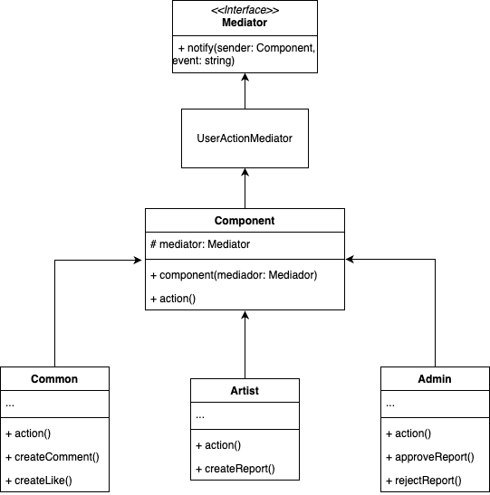

# 3.3.3 Mediator

## Introdução

O Mediator é um padrão de projeto da Gang of Four (GoF) pertencente ao grupo dos padrões Comportamentais, cujo objetivo é centralizar a comunicação entre objetos, reduzindo o acoplamento direto entre eles. Dessa forma, os objetos não se comunicam diretamente uns com os outros, mas através de um objeto mediador.

Esse padrão é especialmente útil quando há múltiplos objetos que precisam interagir de maneira complexa, tornando difícil gerenciar essas dependências diretas. Ao utilizar um mediador, o sistema se torna mais organizado, facilitando a manutenção, a expansão e a compreensão do fluxo de comunicação entre os componentes.

## Metodologia

#### Para o desenvolvimento do Mediator, foram adotadas as seguintes etapas metodológicas:

1. Foi elaborado um diagrama de classes que serviu como base para estruturar os elementos envolvidos no padrão, suas relações e hierarquias.

2. Como suporte teórico, foram utilizados os slides e as videoaulas disponibilizadas pela professora, que forneceram embasamento sobre o funcionamento, os princípios e os casos de uso do padrão Mediator.

3. Também foi consultado o Guia de orientação indicado pela professora, que complementou o entendimento dos conceitos, boas práticas e requisitos para a construção do diagrama.

4. O diagrama foi modelado na ferramenta draw.io, permitindo uma visualização clara da composição dos objetos, seus relacionamentos e a hierarquia definida, de acordo com os princípios da UML.

## Desenvolvimento

O diagrama mostra como o padrão Mediator organiza a comunicação entre os tipos de usuários, Common, Artist e Admin, sem que eles falem diretamente entre si. Cada um tem suas ações específicas, como criar comentários ou aprovar reports, mas quem coordena tudo é o UserActionMediator. Isso deixa o sistema mais simples, evitando que as classes fiquem dependentes umas das outras, e facilita futuras mudanças.

<font size="2"><p style="text-align: center">Figura 1 - Diagrama Mediator</p></font>

<center>



</center>

<font size="2"><p style="text-align: center">Autor(es): [Jésus Gabriel](https://github.com/xGabrielCv) & [Alana Gabriele](https://github.com/alanagabriele), 2025.</p></font>

## Código

O código completo pode ser visualizado na branch [code-mediator](https://github.com/UnBArqDsw2025-1-Turma01/2025.1-T01-_G2_PinacotecaOnline_Entrega_03/tree/code-mediator).

### Vídeo

<font size="2"><p style="text-align: center">Vídeo 1 - Código Mediator</p></font>

<center>

<iframe width="560" height="315" src="https://www.youtube.com/embed/u5x4k6ktA0w?si=RUuqlkDOB0mutyst" title="YouTube video player" frameborder="0" allow="accelerometer; autoplay; clipboard-write; encrypted-media; gyroscope; picture-in-picture; web-share" referrerpolicy="strict-origin-when-cross-origin" allowfullscreen></iframe>

</center>

<font size="2"><p style="text-align: center">Autor: [Alana Gabriele](https://github.com/alanagabriele), 2025.</p></font>

### Mediator

#### mediator.interface.ts

```typescript
import { Component } from "./ component.abstract";

export interface Mediator {
  notify(sender: Component, event: string): void;
}
```

#### user.action.mediator.ts

```typescript
import { Component } from "./ component.abstract";
import { Mediator } from "./ mediator.interface";

export class UserActionMediator implements Mediator {
  notify(sender: Component, event: string): void {
    console.log(
      `Mediator received event: ${event} from ${sender.constructor.name}`
    );

    switch (event) {
      case "createComment":
        console.log("Criação de comentário iniciada");
        break;
      case "createLike":
        console.log("Criação de curtida iniciada");
        break;
      case "createReport":
        console.log("Criação de relatório iniciada");
        break;
      case "approveReport":
        console.log("Aprovando relatório");
        break;
      case "rejectReport":
        console.log("Rejeitando relatório");
        break;
      default:
        console.log("Evento desconhecido recebido pelo Mediator.");
    }
  }
}
```

### component.abstract.ts

```typescript
import { Mediator } from "./ mediator.interface";

export abstract class Component {
  constructor(protected mediator: Mediator) {}

  abstract action(): void;
}
```

### common.component.ts

```typescript
import { Component } from "./ component.abstract";

export class Common extends Component {
  action(): void {
    this.createComment();
  }

  createComment(): void {
    this.mediator.notify(this, "createComment");
  }

  createLike(): void {
    this.mediator.notify(this, "createLike");
  }
}
```

### admin.component.ts

```typescript
import { Component } from "./ component.abstract";

export class Admin extends Component {
  action(): void {
    this.approveReport();
  }

  approveReport(): void {
    this.mediator.notify(this, "approveReport");
  }

  rejectReport(): void {
    this.mediator.notify(this, "rejectReport");
  }
}
```

### artist.component.ts

```typescript
import { Component } from "./ component.abstract";

export class Artist extends Component {
  action(): void {
    this.createReport();
  }

  createReport(): void {
    this.mediator.notify(this, "createReport");
  }
}
```

## Conclusão

A aplicação do padrão Mediator na Pinacoteca Online foi essencial para reduzir o acoplamento entre os componentes da interface. O padrão proporcionou uma comunicação mais eficiente e centralizada, facilitando a manutenção, a escalabilidade e a clareza do sistema. Isso permitiu que futuras alterações ou expansões na interface fossem feitas de forma mais simples e segura, melhorando a qualidade geral do projeto.

## Bibliografia

> 1. <a id="ref1"></a> Mediator - Padrão Comportamental. Refactoring Guru. Disponível em: https://refactoring.guru/pt-br/design-patterns/mediator. Acesso em: 1 de Junho de 2025.

> 2. <a id="ref2"></a> Gamma, Erich. Padrões de projetos: soluções reutilizáveis. Bookman editora, 2009.

> 3. <a id="ref3"></a> Gamma, E.; Helm, R.; Johnson, R.; Vlissides, J. Padrões de Projeto: Soluções Reutilizáveis de Software Orientado a Objetos. Tradução de Luiz A. Meirelles Salgado. Porto Alegre: Bookman, 2007.

> 4. <a id="ref4"></a> Mediator Design Pattern - SourceMaking. Disponível em: https://sourcemaking.com/design_patterns/mediator. Acesso em: 1 de Junho de 2025.

> 5. SERRANO, Milene. Arquitetura e Desenho de Software - Aula - GoFs Comportamentais. https://unbbr-my.sharepoint.com/:v:/g/personal/mileneserrano_unb_br/Ed5jtliOrNVOlKoPe-6Llp0BNLgJ9Q6NHPIKnzmshzHmvA?e=517a4O Acesso em: 1 de Junho de 2025.

## Histórico de Versões

| Versão | Data      | Descrição                                                                                                                | Autor(es)                                                                                         | Revisor(es) | Detalhes da revisão |
| ------ | --------- | ------------------------------------------------------------------------------------------------------------------------ | ------------------------------------------------------------------------------------------------- | ----------- | ------------------- |
| 1.0    | 01/06/2024 | Criação do documento, modelagem inicial do diagrama e adição da introdução, metodologia, Bibliografia e Desenvolvimento. | [Jésus Gabriel](https://github.com/xGabrielCv) [Alana Gabriele](https://github.com/alanagabriele) |   [Danielle Rodrigues](https://github.com/Danizelle)  |                     |
| 1.1    | 01/06/2024 | Adição do código e do vídeo.                                                                                             | [Jésus Gabriel](https://github.com/xGabrielCv) [Alana Gabriele](https://github.com/alanagabriele) |    [Danielle Rodrigues](https://github.com/Danizelle)   |    O GoF foi totalmente revisado e não foram identificados problemas.     |


