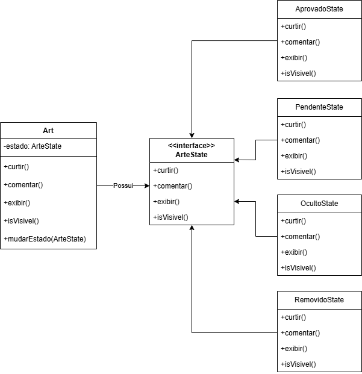

# 3.3.4. State

## Introdução

Com o objetivo de criar um ambiente colaborativo e dinâmico, o sistema está sendo desenvolvido utilizando boas práticas de arquitetura de software e padrões de projeto GoF (Gang of Four), com destaque para o uso do padrão comportamental **State** na gestão do ciclo de vida das obras de arte.

A aplicação do padrão State surgiu da necessidade de encapsular diferentes comportamentos de uma obra com base no seu estado atual — como `pendente`, `aprovado`, `oculto` ou `removido`. Isso permitiu evitar condicionais complexas, manter o código mais limpo e facilitar futuras extensões.

## Metodologia

A metodologia adotada para a implementação do padrão **GoF State** seguiu uma abordagem orientada a objetos e baseada em princípios SOLID, especialmente:

- **Single Responsibility Principle (SRP)**: Cada classe tem apenas uma responsabilidade bem definida.
- **Open/Closed Principle (OCP)**: O sistema é aberto para extensão (novos estados) mas fechado para modificação.

### 1. Análise do Domínio

No contexto do projeto, identificamos que uma obra (`Art`) pode estar em diferentes estados ao longo de seu ciclo de vida:

- **Pendente**: Arte postada, mas ainda não revisada/moderada.
- **Aprovado**: Arte visível ao público.
- **Oculto**: Arte oculta (por decisão do artista ou moderador).
- **Removido**: Arte excluída logicamente do sistema.

Cada estado apresenta diferentes regras quanto às ações possíveis:
- Curtir
- Comentar
- Exibir no feed
- Ser editada/removida

Essa variação de comportamento indicou claramente a necessidade de aplicar o padrão **State**, evitando lógica condicional espalhada pelo código.

### 2. Modelagem do Padrão State

O padrão **State** foi modelado com as seguintes partes:

#### a) Interface `ArteState`
Define os métodos cujo comportamento varia conforme o estado da arte:
- `curtir()`
- `comentar()`
- `exibir()`
- `isVisivel()`

Com o objetivo de garantir consistência entre todos os estados possíveis e permitir delegação sem acoplamento.

#### b) Classes Concretas de Estado
Implementações específicas para cada estado:
- `AprovadoState`
- `PendenteState`
- `OcultoState`
- `RemovidoState`

Cada estado encapsula seu próprio comportamento, evitando ifs/switches e facilitando a manutenção.

#### c) Classe Contexto: `Art`
Armazena a referência ao estado atual e delega chamadas aos métodos definidos na interface. Para ter um único ponto de entrada para todas as operações, mantendo a classe `Art` desacoplada da lógica interna de cada estado.

### 3. Decisões de Projeto

- **Separação entre estado e lógica de negócio**: A classe `Art` não precisa saber "como" cada estado funciona — apenas delegar.
- **Flexibilidade para extensão futura**: Novos estados podem ser adicionados sem alterar o código existente.
- **Mudança dinâmica de comportamento**: O estado pode ser trocado em tempo de execução via método `setEstado()`.

### 4. Integração com Outros Módulos

- **Content Module:** Verifica se a arte é visível antes de exibí-la no feed.
- **Interaction Module:** Valida permissões de curtir/comentar com base no estado.
- **Moderation Module:** Permite alterar o estado de uma arte via painel de administração.

## Diagrama do GoF State

<font size="2"><p style="text-align: center"><b>Figura 1:</b> Diagrama do padrão GoF State aplicado à classe <code>Art</code>.</p></font>



<font size="2"><p style="text-align: center"><b>Autor:</b> Lucas Heler Lopes, 2025.</p></font>

<p>O contexto (<code>Art</code>) armazena um estado (<code>ArteState</code>) e delega chamadas aos métodos definidos na interface. Cada estado concreto implementa seu próprio comportamento.</p>

## Código

A seguir está todo o código.

### `art.interfaces/arte-state.interface.ts`
```
export interface ArteState {
  curtir(): void;
  comentar(): void;
  exibir(): void;
  isVisivel(): boolean;
}
```
### `states/aprovado.state.ts`
```
import { ArteState } from '../interfaces/arte-state.interface';

export class AprovadoState implements ArteState {
  curtir(): void {
    console.log('Curtindo esta arte.');
  }

  comentar(): void {
    console.log('Comentando nesta arte.');
  }

  exibir(): void {
    console.log('Arte está visível ao público.');
  }

  isVisivel(): boolean {
    return true;
  }
}
```
### `states/pendente.state.ts`
```
import { ArteState } from '../interfaces/arte-state.interface';

export class PendenteState implements ArteState {
  curtir(): void {
    console.log('Não é possível curtir. A arte ainda está pendente.');
  }

  comentar(): void {
    console.log('Não é possível comentar. A arte ainda está pendente.');
  }

  exibir(): void {
    console.log('Arte não está visível ao público.');
  }

  isVisivel(): boolean {
    return false;
  }
}
```
### `states/oculto.state.ts`
```
import { ArteState } from '../interfaces/arte-state.interface';

export class OcultoState implements ArteState {
  curtir(): void {
    console.log('Não é possível curtir. A arte está oculta.');
  }

  comentar(): void {
    console.log('Não é possível comentar. A arte está oculta.');
  }

  exibir(): void {
    console.log('Arte não está visível ao público.');
  }

  isVisivel(): boolean {
    return false;
  }
}
```
### `states/removido.state.ts`
```
import { ArteState } from '../interfaces/arte-state.interface';

export class RemovidoState implements ArteState {
  curtir(): void {
    console.log('Não é possível curtir. A arte foi removida.');
  }

  comentar(): void {
    console.log('Não é possível comentar. A arte foi removida.');
  }

  exibir(): void {
    console.log('Arte foi removida e não está mais disponível.');
  }

  isVisivel(): boolean {
    return false;
  }
}
```
### `entities/art.entity.ts`
```
import { ArteState } from '../interfaces/arte-state.interface';

export class Art {
  private estado: ArteState;

  constructor(estadoInicial: ArteState) {
    this.estado = estadoInicial;
  }

  public curtir(): void {
    this.estado.curtir();
  }

  public comentar(): void {
    this.estado.comentar();
  }

  public exibir(): void {
    this.estado.exibir();
  }

  public isVisivel(): boolean {
    return this.estado.isVisivel();
  }

  public mudarEstado(novoEstado: ArteState): void {
    this.estado = novoEstado;
  }
}
```
### `services/art.service.ts`
```
import { Injectable } from '@nestjs/common';
import { Art } from '../entities/art.entity';
import { AprovadoState, PendenteState } from '../states';

@Injectable()
export class ArtService {
  criarArtePendente(): Art {
    return new Art(new PendenteState());
  }

  aprovarArte(arte: Art): void {
    arte.mudarEstado(new AprovadoState());
  }

  ocultarArte(arte: Art): void {
    arte.mudarEstado(new OcultoState());
  }

  removerArte(arte: Art): void {
    arte.mudarEstado(new RemovidoState());
  }
}
```
### `controllers/art.controller.ts`
```
import { Controller, Get, Post, Body, Param } from '@nestjs/common';
import { ArtService } from '../services/art.service';
import { Art } from '../entities/art.entity';

@Controller('arts')
export class ArtController {
  constructor(private readonly artService: ArtService) {}

  @Get('criar-pendente')
  criarArtePendente(): Art {
    const arte = this.artService.criarArtePendente();
    arte.exibir(); // Arte não está visível ao público.
    return arte;
  }

  @Post(':id/aprovar')
  aprovarArte(@Param('id') id: string): string {
    const arte = this.artService.criarArtePendente();
    this.artService.aprovarArte(arte);
    arte.exibir(); // Arte está visível ao público.
    return `Arte ${id} aprovada.`;
  }
}
```

## Conclusão

O padrão **State** mostra-se extremamente útil no projeto **Pinacoteca Online**, especialmente para gerenciar o ciclo de vida das obras de arte. Ao guardar o comportamento específico de cada estado em classes independentes, conseguimos:

- Reduzir o uso de condicionais complexas
- Melhorar a organização do código
- Facilitar a extensão futura com novos estados
- Garantir coesão e baixo acoplamento entre as partes do sistema

https://unbbr-my.sharepoint.com/personal/mileneserrano_unb_br/_layouts/15/stream.aspx?id=%2Fpersonal%2Fmileneserrano%5Funb%5Fbr%2FDocuments%2FArqDSW%20%2D%20V%C3%ADdeosOriginais%2F10d%20%2D%20Video%2DAula%20%2D%20DSW%20%2D%20GoFs%20%2D%20Comportamentais%20%2D%20Demais%2Emp4&ga=1&referrer=StreamWebApp%2EWeb&referrerScenario=AddressBarCopied%2Eview%2E22fd625e%2D8769%2D49d7%2Db219%2D097d6939d4ee

## Bibliografia
> State - Padrão Comportamental. Refactoring Guru. Disponível em: https://refactoring.guru/design-patterns/state. Acesso em: 30 de maio. de 2025.

> SERRANO, Milene. 10d - Video-Aula - DSW - GoFs - Comportamentais - Demais Padrões - Visões. 1 vídeo (aula de Arquitetura e Desenho de Software). Disponível em: https://unbbr-my.sharepoint.com/personal/mileneserrano_unb_br/_layouts/15/stream.aspx?id=%2Fpersonal%2Fmileneserrano%5Funb%5Fbr%2FDocuments%2FArqDSW%20%2D%20V%C3%ADdeosOriginais%2F10d%20%2D%20Video%2DAula%20%2D%20DSW%20%2D%20GoFs%20%2D%20Comportamentais%20%2D%20Demais%2Emp4&ga=1&referrer=StreamWebApp%2EWeb&referrerScenario=AddressBarCopied%2Eview%2E22fd625e%2D8769%2D49d7%2Db219%2D097d6939d4ee. Acesso em: 31 maio 2025.

> State Design Pattern. SourceMaking. Disponível em: https://sourcemaking.com/design_patterns/state. Acesso em: 01 de junho. de 2025.

## Histórico de Versões

| Versão | Data       | Descrição                                                                                                       | Autor(es)                                     | Revisor(es)             | Detalhes da revisão |
| ------ | ---------- | --------------------------------------------------------------------------------------------------------------- | --------------------------------------------- | ----------------------- | ------------------- |
| 1.0    | 01/06/2025 | Adição do documento, introdução e desenvolvimento do Gof State. | [Davi Rodrigues](https://github.com/DaviRogs) | [](https://github.com/) |                     |
| 1.1    | 01/06/2025 | Adição do Código e diagrama, conclusão e bibliografia. | [Lucas Heler](https://github.com/Akaeboshi) | [](https://github.com/) |                     |
