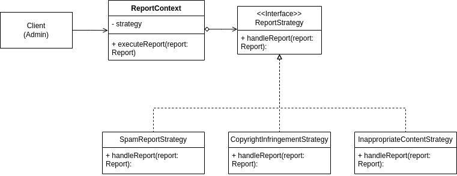

# 3.3.5. Strategy

## Introdução

Este documento apresenta a aplicação do padrão de projeto Strategy no desenvolvimento da Pinacoteca Online.

O padrão Strategy, classificado como um padrão comportamental pelo Gang of Four (GoF), permite definir uma família de algoritmos, encapsular cada um deles e torná-los intercambiáveis (REFACTORING GURU, 2024). Essa abordagem possibilita que o algoritmo varie independentemente dos clientes que o utilizam, promovendo flexibilidade e a capacidade de alterar o comportamento de um objeto em tempo de execução.

## Metodologia

Para o desenvolvimento do trabalho, foram realizadas as seguintes etapas:

1. Estudo do conteúdo: foi assistida a videoaula disponível no Aprender 3, complementada por pesquisas adicionais na internet para aprofundamento no tema.
2. Análise do diagrama de classes: após a compreensão do conteúdo, foi analisado onde o padrão Strategy poderia ser aplicado.
3. Elaboração do diagrama: o diagrama referente ao padrão Proxy foi criado utilizando a plataforma draw.io.
<!-- 4. Implementação do código: foi realizada a codificação conforme o diagrama elaborado. -->
4. Elaboração do documento: o documento foi elaborado e aprimorado ao longo de todas as etapas anteriores, consolidando o processo.

## Desenvolvimento

Ao analisar o diagrama de classes, identificou-se que uma das funcionalidades do projeto consiste na possibilidade de denunciar conteúdos inapropriados, como comentários ou publicações artísticas. Para cada tipo de denúncia, diferentes medidas precisam ser adotadas — a lógica para tratar um relatório de SPAM difere daquela necessária para lidar com uma violação de direitos autorais, que, por sua vez, também se distingue do tratamento para conteúdo inadequado.

Concentrar todas essas variações de comportamento em um único método, utilizando múltiplas estruturas condicionais (if/else if/else), resultaria em um código excessivamente complexo, de difícil manutenção, testes e evolução. Para mitigar esse problema e promover a flexibilidade, verificou-se que a adoção do padrão Strategy seria uma solução adequada.

O padrão Strategy permite definir uma família de algoritmos (neste caso, as diferentes lógicas de processamento de relatórios), encapsular cada um deles em classes separadas e torná-los intercambiáveis. Assim, em vez de o sistema ter um código monolítico com condicionais para cada tipo de denúncia, o componente responsável pelo processamento de relatórios (o Contexto) mantém uma referência para uma interface comum. Ele delega a execução do processamento a essa interface, que será implementada por classes concretas, cada uma contendo a lógica específica para um tipo de denúncia. Esse mecanismo proporciona um código mais limpo, coeso e desacoplado, facilitando a adição de novos tipos de denúncias ou a modificação de regras existentes sem afetar o código principal de processamento.

O diagrama a seguir ilustra a lógica de implementação:

### Diagrama

<font size="2"><p style="text-align: center"><b>Figura 1:</b> Diagrama de Classes que ilustra aplicação do padrão Strategy</p></font>

<div style="text-align: center;">



</div>

<font size="2"><p style="text-align: center"><b>Autor:</b> <a href="https://github.com/leanars">Leandro Almeida</a>, 2025</p></font>

O diagrama detalha os seguintes componentes e seu fluxo de interação:

- Client (Admin): Representa o usuário do sistema responsável por acionar o processo de tratamento das denúncias. O cliente interage diretamente com a classe ReportContext.
- ReportContext: Classe responsável por manter uma referência à interface ReportStrategy, através do atributo strategy. Esta classe expõe o método executeReport(report: Report), que delega a execução da denúncia para a estratégia apropriada. Com isso, ReportContext age como um ponto de entrada para o cliente, encapsulando a escolha e a execução da estratégia.
- ReportStrategy: Interface que define o contrato comum para todas as estratégias de tratamento de denúncia. Contém o método handleReport(report: Report), que deve ser implementado por todas as classes concretas.
- SpamReportStrategy, CopyrightInfringementStrategy e InappropriateContentStrategy: São as classes concretas que implementam a interface ReportStrategy, cada uma contendo a lógica específica para tratar um determinado tipo de denúncia:
  - SpamReportStrategy: Responsável por processar denúncias classificadas como SPAM.
  - CopyrightInfringementStrategy: Trata casos de violação de direitos autorais.
  - InappropriateContentStrategy: Processa conteúdos classificados como inadequados.

### Código

### Report
### Strategies
### copyright-infringement.strategy
```
import { ReportStrategy } from './report-strategy.interface';
import { Report } from '../types/report.type';

export class CopyrightInfringementStrategy implements ReportStrategy {
  handleReport(report: Report): void {
    console.log(`[COPYRIGHT] Handling copyright infringement for: ${report.content}`);
  }
}
```
### inappropriate-content.strategy
```
import { ReportStrategy } from './report-strategy.interface';
import { Report } from '../types/report.type';

export class InappropriateContentStrategy implements ReportStrategy {
  handleReport(report: Report): void {
    console.log(`[INAPPROPRIATE] Handling inappropriate content: ${report.content}`);
  }
}
```
### report-strategy.interface
```
import { Report } from '../types/report.type';

export interface ReportStrategy {
  handleReport(report: Report): void;
}
```
### spam-report.strategy
```
import { ReportStrategy } from './report-strategy.interface';
import { Report } from '../types/report.type';

export class SpamReportStrategy implements ReportStrategy {
  handleReport(report: Report): void {
    console.log(`[SPAM] Handling spam report for: ${report.content}`);
  }
}
```
### Types

### report type
```
export type ReportType = 'spam' | 'copyright' | 'inappropriate';

export type Report = {
  type: ReportType;
  content: string;
};
```
### report-context.service
```
import { Injectable } from '@nestjs/common';
import { Report } from './types/report.type';
import { ReportStrategy } from './strategies/report-strategy.interface';

@Injectable()
export class ReportContext {
  private strategy: ReportStrategy;

  setStrategy(strategy: ReportStrategy) {
    this.strategy = strategy;
  }

  executeReport(report: Report) {
    this.strategy.handleReport(report);
  }
}
```
### report.controller
```
// src/report/report.controller.ts
import { Body, Controller, Post } from '@nestjs/common';
import { ReportContext } from './report-context.service';
import { SpamReportStrategy } from './strategies/spam-report.strategy';
import { CopyrightInfringementStrategy } from './strategies/copyright-infringement.strategy';
import { InappropriateContentStrategy } from './strategies/inappropriate-content.strategy';
import { Report } from './types/report.type';

@Controller('report')
export class ReportController {
  constructor(private readonly reportContext: ReportContext) {}

  @Post()
  handleReport(@Body() report: Report) {
    switch (report.type) {
      case 'spam':
        this.reportContext.setStrategy(new SpamReportStrategy());
        break;
      case 'copyright':
        this.reportContext.setStrategy(new CopyrightInfringementStrategy());
        break;
      case 'inappropriate':
        this.reportContext.setStrategy(new InappropriateContentStrategy());
        break;
      default:
        throw new Error(`Tipo de denúncia não suportado: ${report.type}`);
    }

    this.reportContext.executeReport(report);
    return { message: 'Denúncia processada com sucesso.' };
  }
}
```
### report.module
```
import { Module } from '@nestjs/common';
import { ReportContext } from './report-context.service';
import { ReportController } from './report.controller';

@Module({
  providers: [ReportContext],
  controllers: [ReportController],
})
export class ReportModule {}
```
### main
```
import { NestFactory } from '@nestjs/core';
import { Module } from '@nestjs/common';
import { ReportModule } from './report/report.module';

@Module({
  imports: [ReportModule],
})
export class AppModule {}

async function bootstrap() {
  const app = await NestFactory.create(AppModule);
  await app.listen(3000);
  console.log('Application is running on http://localhost:3000');
}
bootstrap();
```

## Demonstração do Código sendo Executado

- [Execução do Código](https://drive.google.com/file/d/1OA2HJeqQkvhR6OAtyp-Xw7c8oFQIfyea/view?usp=sharing)</br>
  Participantes: Mateus Cavalcante e Leandro almeida


## Conclusão

A adoção do padrão Strategy na Pinacoteca Online proporcionou uma solução elegante para o tratamento de diferentes tipos de denúncias, como SPAM, violação de direitos autorais e conteúdo inadequado. Ao encapsular cada lógica de processamento em uma estratégia específica, o sistema ficou mais modular, facilitando a manutenção, os testes e a extensão de novas funcionalidades. Dessa forma, foi possível eliminar estruturas condicionais complexas, promovendo um código mais limpo, coeso e alinhado com boas práticas de desenvolvimento orientado a objetos.

## Bibliografia

> GAMMA, Erich; HELM, Richard; JOHNSON, Ralph; VLISSIDES, John. _Design Patterns: Elements of Reusable Object-Oriented Software_. Addison-Wesley, 1994.

> REFACTORING GURU. Strategy design pattern. Disponível em: <https://https://refactoring.guru/design-patterns/strategy>. Acesso em: 31 maio 2025.

## Histórico de Versões

| Versão | Data       | Descrição                                                                                                                | Autor(es)                                     | Revisor(es)             | Detalhes da revisão |
| ------ | ---------- | ------------------------------------------------------------------------------------------------------------------------ | --------------------------------------------- | ----------------------- | ------------------- |
| 1.0    | 31/05/2025 | Adição da introdução, metodologia, diagrama e texto explicativo do diagrama, além das referências utilizadas e conclusão | [Leandro Almeida](https://github.com/leanars) | [](https://github.com/) |                     |
| 1.1    | 01/06/2025 | Adição do código | [mateus cavalcante](https://github.com/mateuscavati) | [Leandro Almeida](https://github.com/leanars) |                     |              |
